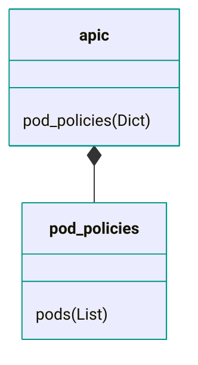
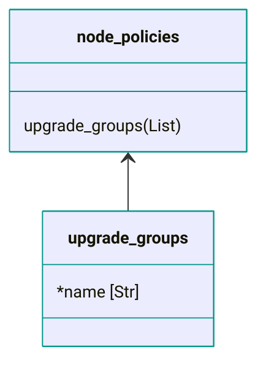
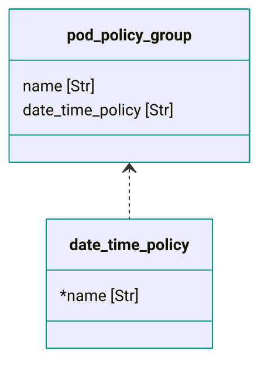

# Overview

The data model formally defines the format of the data input files. The schema (yamale) is then based on the data model and used to validate the data input files.

## Notation

- `*` before the member denotes a mandatory member
- After the member typically the data type follows (eg. Str, Int, Enum, Dict, List, etc.)
- As class names within the data model must be unique, if needed a suffix with a single digit (eg. `_1`) is added to the name

## Relationships

The composition relationship is used for dictionary child elements.

<figure markdown>

</figure>

The association relationship is used for list elements (1:n relationship).

<figure markdown>

</figure>

The dependency relationship is used for other classes being referenced by one of its members.

<figure markdown>

</figure>
