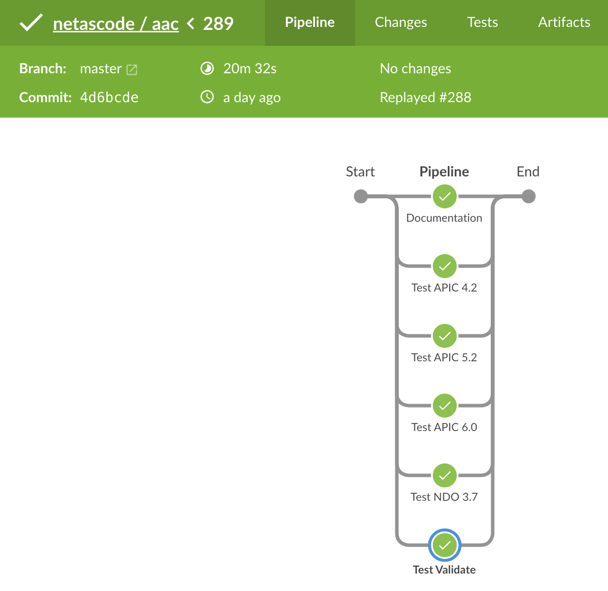
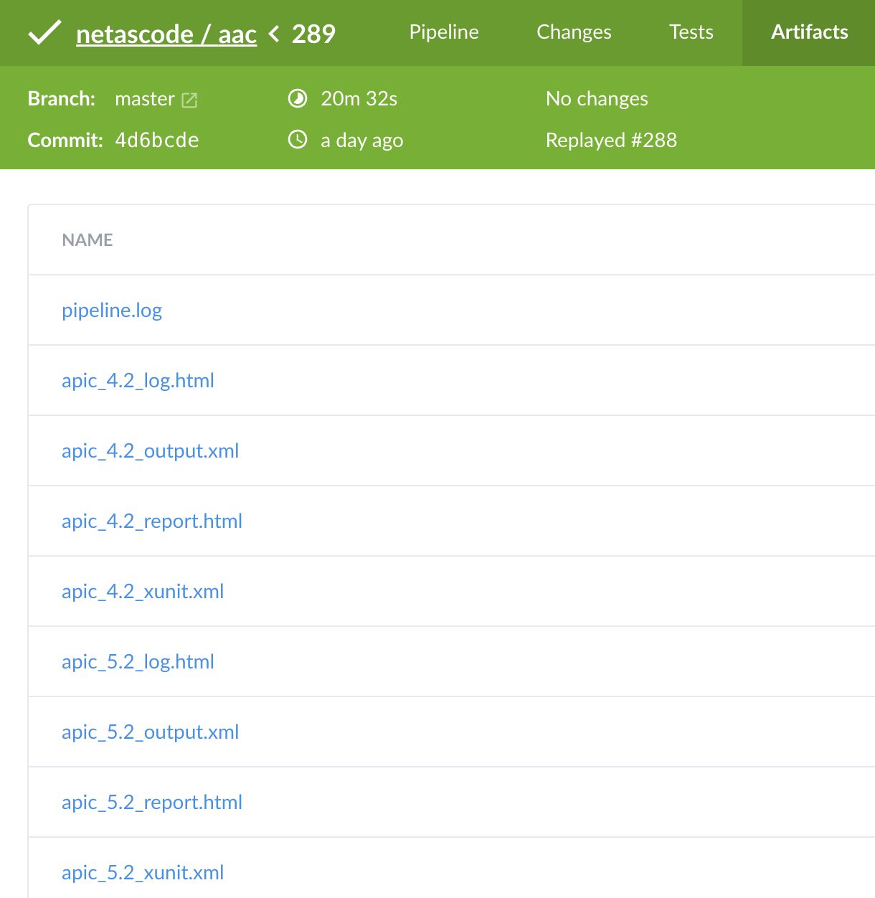

# Overview

We would like to consolidate all feature requests, bug reports, etc. in a single place, which is the [aac](https://wwwin-github.cisco.com/netascode/aac) repository. Whenever you want to start working on a new feature, you should assign the respective issue to yourself to indicate to others that you are working on a new feature or in case an issue does not yet exist, you should create a new one and assign it to yourself.

Assuming you want to add a new feature to ACI-as-Code, these are the high-level steps.

## Update Schema

Add new elements to the schema located in the [aac](https://wwwin-github.cisco.com/netascode/aac/tree/master/schemas) repository (`schemas/`). Documentation about schema elements can be found here: <https://github.com/23andMe/Yamale>. As a reference for allowed values we can consult the ACI Object Model Reference Documentation - <https://developer.cisco.com/site/apic-mim-ref-api/> . Bigger changes to the data model should be discussed in a draft pull request to avoid significant re-work later.

A few conventions we try to follow:

- Rather use full names instead of abbreviations: endpoint_group vs. epg
- Always use plural for list types, e.g. tenants, endpoint_groups, etc.
- If it is a boolean value, use a boolean type, even if a string (for example 'enabled'/'disabled') is used in ACI object model

## Update Default Values

Add new elements to the defaults.yaml file located in the [aac](https://wwwin-github.cisco.com/netascode/aac/tree/master/defaults) repository (`defaults/`). Default values should align with the commonly agreed best practices and otherwise with the ACI object model default values. As a reference for ACI default values we can consult the ACI Object Model Reference Documentation - <https://developer.cisco.com/site/apic-mim-ref-api/> .

## Add Configuration Template

Add configuration (Jinja2) template in the [aac](https://wwwin-github.cisco.com/netascode/aac/tree/master/templates/apic/deploy) repository (`templates/apic/deploy/`).

```jinja
{
  "infraInfra": {
    "attributes": {
      "dn": "uni/infra"
    },
    "children": [
      
      {{ comma1() }}
      
      {
        "cdpIfPol": {
          "attributes": {
            "annotation": "orchestrator:aac",
            "name": "{{ cdp_policy_name }}",
            "dn": "uni/infra/cdpIfP-{{ cdp_policy_name }}",
            "adminSt": "{{ policy.admin_state | cisco.aac.aac_bool("enabled") }}"
          }
        }
      }
      

    ]
  }
}
```

## Add Test Template(s)

Add test (Jinja2) templates in the [aac](https://wwwin-github.cisco.com/netascode/aac/tree/master/templates/apic/test) repository (`templates/apic/test/`).

```jinja
*** Settings ***
Documentation   Verify CDP Interface Policy
Suite Setup     Login APIC
Default Tags    apic   day1   config   access_policies
Resource        ../../apic_common.resource

*** Test Cases ***



Verify CDP Interface Policy {{ cdp_policy_name }}
    ${r}=   GET On Session   apic   /api/mo/uni/infra/cdpIfP-{{ cdp_policy_name }}.json
    Should Be Equal Value Json String   ${r.json()}    $..cdpIfPol.attributes.name   {{ cdp_policy_name }}
    Should Be Equal Value Json String   ${r.json()}    $..cdpIfPol.attributes.adminSt   {{ policy.admin_state | cisco.aac.aac_bool("enabled") }}


```

## Update Object Inventory

Update `apic_objects.yaml` in the [aac](https://wwwin-github.cisco.com/netascode/aac/tree/master/objects) repository (`objects/`).

```yaml
  - name: CDP Interface Policy
    template: cdp_policy
    folder: access_policies
    aci_classes:
      - cdpIfPol
    delete_ignore:
      - system-cdp-enabled
      - system-cdp-disabled
    test_types:
      - config
    paths:
      - apic.access_policies.interface_policies.cdp_policies
```

- `name`: Descriptive name of the object, will be used in Ansible output
- `template`: Template filename without extensions
- `folder`: Folder of template file -> templates/apic/deploy/access_policies/cdp_policy.j2
- `aci_classes`: List of root classes, which will be considered for deletion in Ansible
- `delete_ignore`: List of object names that should not be deleted
- `test_types`: List of associated tests (config, health, operational)
- `paths`: List of YAML paths containing relevant configuration

## Add Test Data

Add relevant test data in the [aac](https://wwwin-github.cisco.com/netascode/aac/tree/master/tests/integration/fixture/apic/) repository. Test data is located in `tests/integration/fixture/apic/` directory. Data relevant for all ACI versions is in `standard/` sub-directory, whereas version specific directories exist as well - e.g., `standard_52/`. Test data should typically cover all relevant scenarios, which is at least a scenario with the minimal configuration and a configuration with all values configured.

```yaml
apic:
  tenants:
    - name: ABC
      policies:
        ospf_interface_policies:
          - name: OIP1
            description: My Desc
            cost: 40
            passive_interface: true
            mtu_ignore: true
            advertise_subnet: true
            bfd: true
            hello_interval: 30
            dead_interval: 180
            network_type: p2p
            priority: 2
            lsa_retransmit_interval: 6
            lsa_transmit_delay: 2
          - name: OIP2
```

## Update Documentation

Update documentation in the [aac](https://wwwin-github.cisco.com/netascode/aac/tree/master/docs/) repository, which is located in `docs/` directory. The data model documentation is to some extend auto-generated and depends on markdown templates which are located in the `docs/templates/` directory.
The `{{ doc_gen }}` placeholder will be replaced by an auto-generated class diagram and a list of tables.

````md
# CDP Interface Policy

Location in GUI:
`Fabric` » `Access Policies` » `Policies` » `Interface` » `CDP Interface`


{{ doc_gen }}

### Examples

```yaml
apic:
  access_policies:
    interface_policies:
      cdp_policies:
        - name: CDP-ENABLED
          admin_state: true 
```
````

## Update Documentation Index

If a new page is added to the documentation, the navigation index would need to be updated as well. This index is being maintained in the `mkdocs.yml` file in the repository root location.

```yaml
nav:
  - Home: index.md
  - Data Model:
      - Overview: data_model/overview.md
      - APIC:
          - Overview: data_model/apic_overview.md
          - Support Matrix: data_model/apic_support_matrix.md
          - Bootstrap:
              - Bootstrap: data_model/apic/bootstrap/bootstrap.md
          - Access Policies:
              - CDP Interface Policy: data_model/apic/access_policies/cdp_policy.md
```

## Integration Tests

After opening a Pull Request against the master branch, a Jenkins pipeline triggers a series of integration tests.

<figure markdown>
  { width="500" }
</figure>

<figure markdown>
  { width="500" }
</figure>

## Terraform Development

Once the feature has been merged into the master branch of the `aac` repository, you can continue with adding support for the Terraform based solution. Please continue [here](./terraform/).
