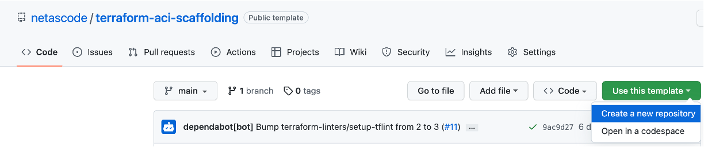

# Terraform Development

When developing new Terraform Modules there is a [scaffolding](https://github.com/netascode/terraform-aci-scaffolding) (template) repository which can be used to create a new repository based on this template.

<figure markdown>
  { width="600" }
</figure>

## Development Environment Setup

For Module Development it is recommended to have the following tools installed:

- `tflint`: A Terraform linting tool to enforce best practices when writing Terraform code
- `terraform-docs`: A tool that renders Terraform module documentation (readme) from code
- `pre-commit`: Integrate various tools, like the ones mentioned above, to be run before a commit is allowed.

To trigger a manual run of all pre-commit tools, the following command can be used:

```bash
$ pre-commit run -a
Terraform fmt............................................................Passed
Terraform validate with tflint...........................................Passed
terraform-docs...........................................................Passed
terraform-docs...........................................................Passed
```

## Module Variables

Module variable names should be aligned with the data model. Every variable should a have a description which is then displayed in the readme but eventually also in the Terraform Registry once the module is published. Where possible, validation rules should be used.

```terraform
variable "name" {
  description = "Tenant name."
  type        = string

  validation {
    condition     = can(regex("^[a-zA-Z0-9_.-]{0,64}$", var.name))
    error_message = "Allowed characters: `a`-`z`, `A`-`Z`, `0`-`9`, `_`, `.`, `-`. Maximum characters: 64."
  }
} 
```

## Module Outputs

Every Module typically has two outputs, one being the DN of the 'rootÄ object and the other being the name and/or identifier of the 'root' object.

```terraform
output "dn" {
  value       = aci_rest_managed.fvTenant.id
  description = "Distinguished name of `fvTenant` object."
}

output "name" {
  value       = aci_rest_managed.fvTenant.content.name
  description = "Tenant name."
}
```

## Module Documentation

The `.terraform-docs.yml` file in the root directory is used as a configuration file for `terraform-docs`. Additional documentation, like a path pointing to the respective object in the GUI is maintained here. A separate configuration file exists in the `examples/` directory which is used to render the readme for the example.

````yaml
version: '>= 0.14.0'

formatter: markdown table

content: |-
  [](https://github.com/netascode/terraform-aci-scaffolding/actions/workflows/test.yml)

  # Terraform ACI Scaffolding Module

  Description

  Location in GUI:
  `Tenants` » `XXX`

  ## Examples

  ```hcl
  {{ include "./examples/complete/main.tf" }}
  ```
````

## Module Example

One or more examples of how to use the module are located in the `examples/` directory. These example configurations will be added to the readme but will also be available in the Terraform Registry.

```terraform
module "aci_scaffolding" {
  source  = "netascode/scaffolding/aci"
  version = ">= 0.1.0"

  name        = "ABC"
  alias       = "ABC-ALIAS"
  description = "My Description"
}
```

## Module Tests

Terraform provides an (experimental) framework for writing integration tests using native Terraform code. Documentation can be found here: <https://developer.hashicorp.com/terraform/language/modules/testing-experiment> . Each test case is created in the `tests/` directory, where each test case can consist of one or more Terraform configurations. A test case typically consists of the module being used first and then using data sources to query the configuration state and verify it using assertions.

```terraform
module "main" {
  source = "../.."

  name = "ABC"
}

data "aci_rest_managed" "fvTenant" {
  dn = "uni/tn-ABC"

  depends_on = [module.main]
}

resource "test_assertions" "fvTenant" {
  component = "fvTenant"

  equal "name" {
    description = "name"
    got         = data.aci_rest_managed.fvTenant.content.name
    want        = "ABC"
  }
}
```

## Module Test Execution

A CI workflow ensures that these tests are executed continuously using the public DevNet sandbox (ACI simulator). The tests can also be executed locally using the ’terraform test’ command, where the provider arguments (URL, username, password), need to be provided via environment variables.

```bash
$ export ACI_URL=https://10.1.1.1
$ export ACI_USERNAME=admin
$ export ACI_PASSWORD=Cisco123
$ terraform test
╷
│ Warning: The "terraform test" command is experimental
│ 
│ We'd like to invite adventurous module authors to write integration tests for their modules using this command, but all of the behaviors of
│ this command are currently experimental and may change based on feedback.
│ 
│ For more information on the testing experiment, including ongoing research goals and avenues for feedback, see:
│     https://www.terraform.io/docs/language/modules/testing-experiment.html
╵
Success! All of the test assertions passed.
```
