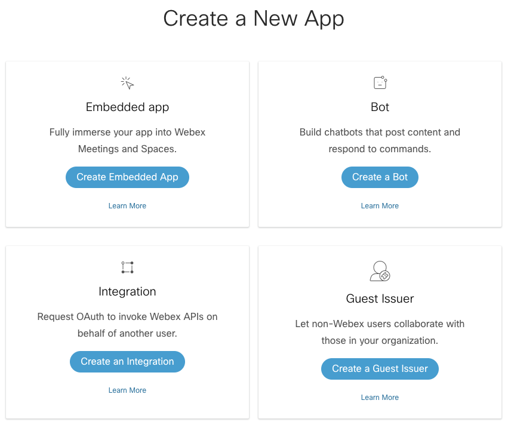
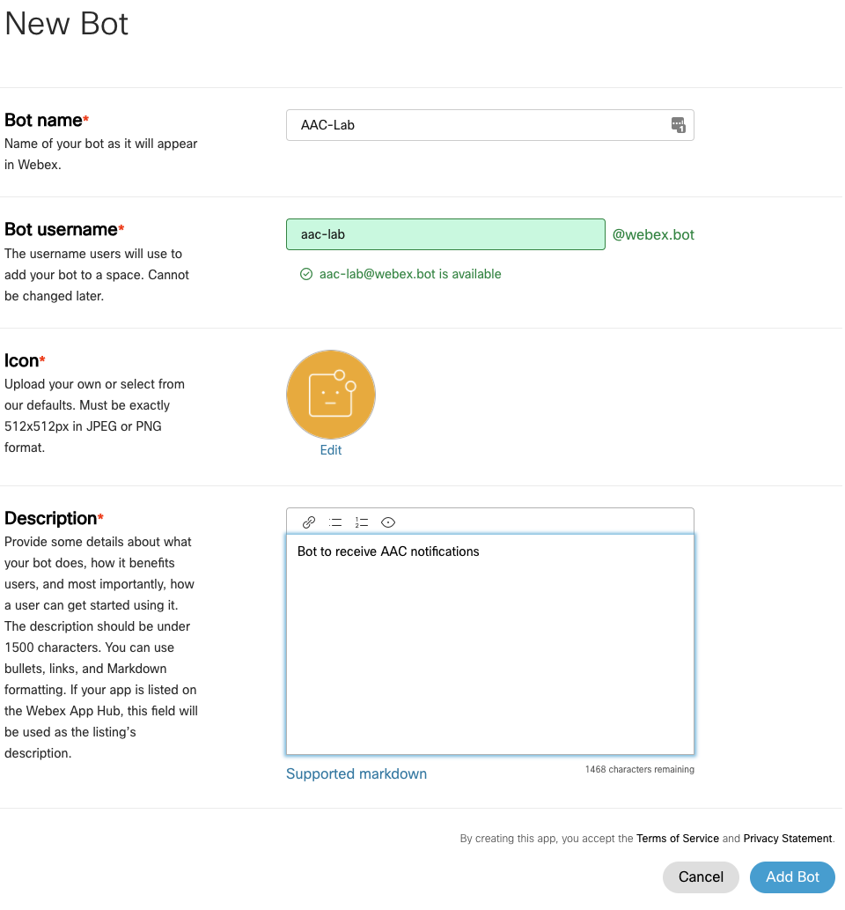
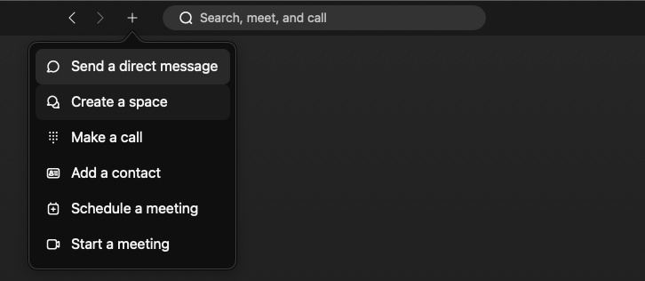
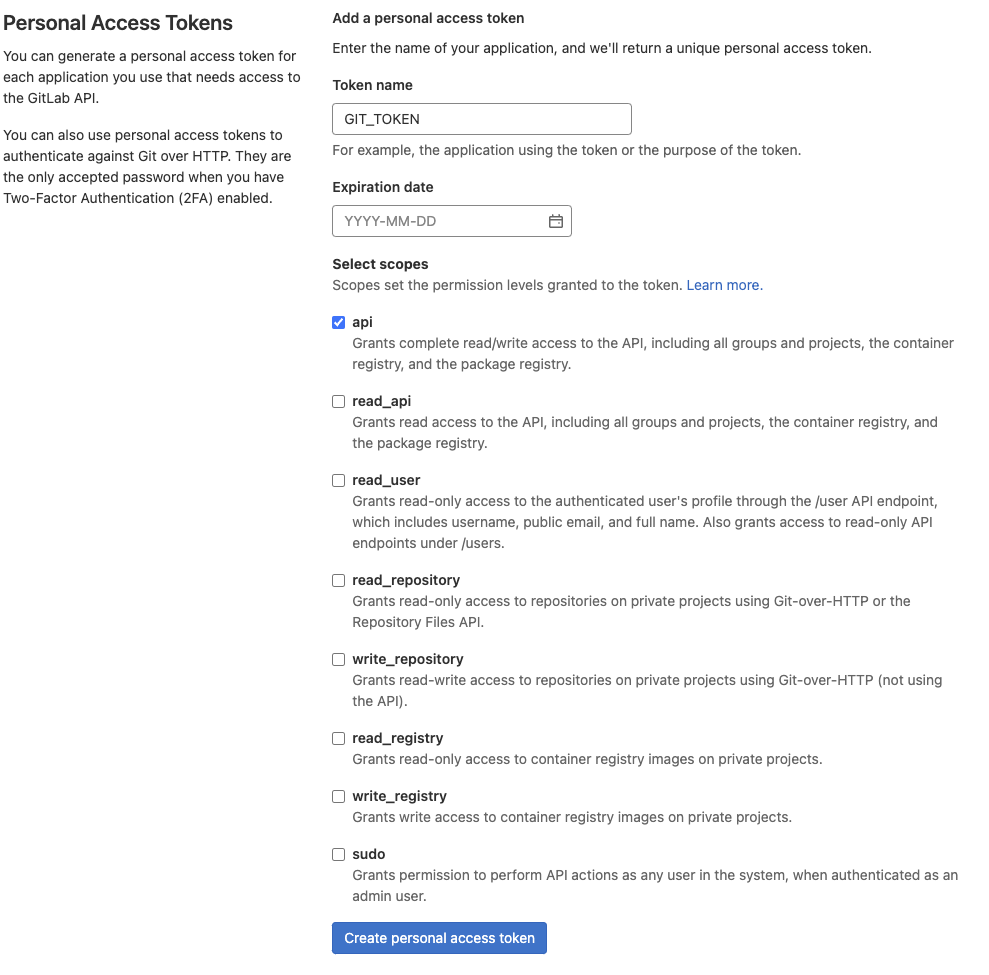
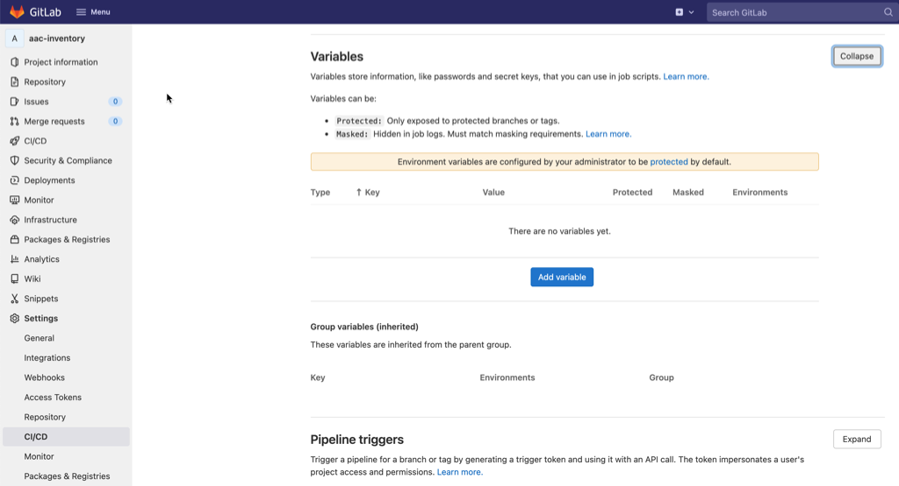
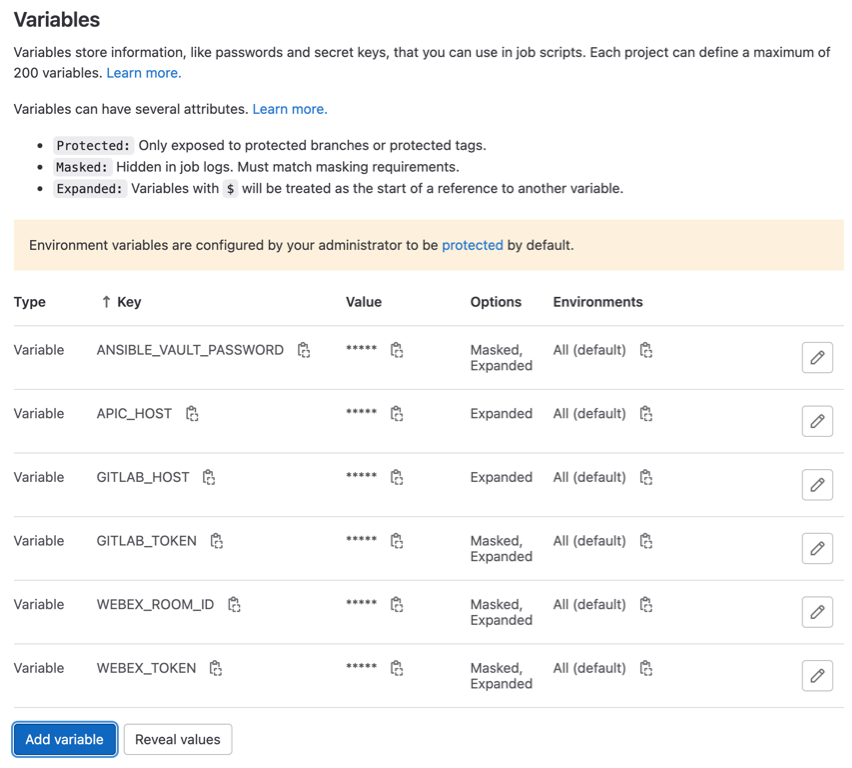
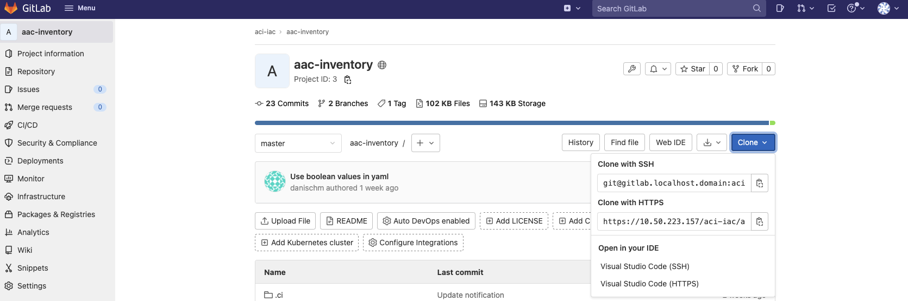
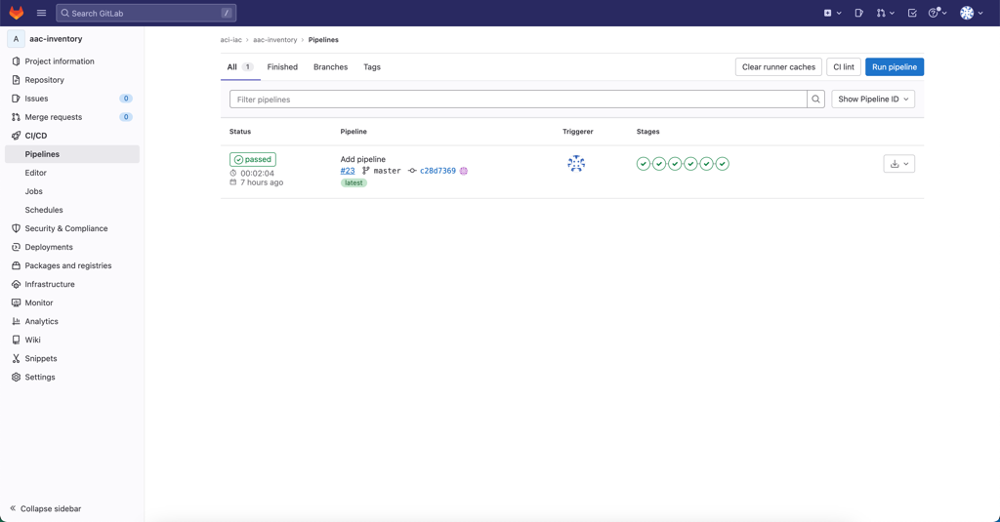
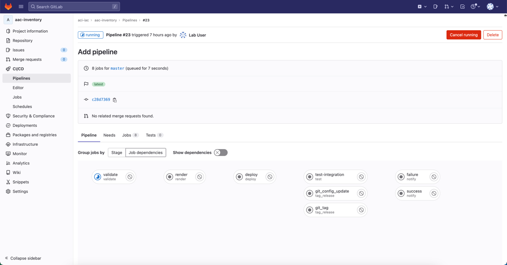
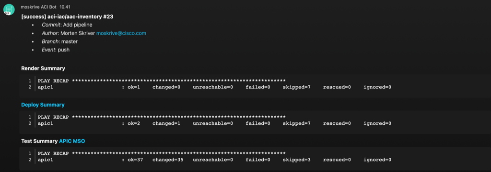

# Run Ansible AAC with CI/CD

## Goal

Integrate Ansible AAC with GitLab CI

This lab builds on top of [Run Ansible AAC manually](../guide_ansible_manual/) and it is assumed that you have preferably completed this lab or at **a minimum** made it past the [Clone AAC Inventory Locally](../guide_ansible_manual/#clone-aac-inventory-locally) step.

## Pre-requisites

- Use an IDE of your choice. This tutorial will assume Visual Studio Code
- Git installed
- Access to GitLab server with GitLab Runner already pre-registered
- Access to ACI Simulator
- Basic to Intermediate understanding of Ansible AAC

## Time Estimate

2h

## Lab Overview and Credentials

Each Lab pod will operate as a self contained unit consisting of the following components:

- 1x Control VM hosting the required software components (Git, Ansible, Robot, CI/CD Platform, etc.) that the ACI as Code solution are build upon
- 1x ACI Simulator

You will be able to access the instances on the following addresses:

- GitLab: <https://CONTROLLER_IP>
- ACI simulator: <https://APIC_IP>

The control VM and ACI simulator can be accessed using the following credentials.

| VM         | Username | Password |
| ---------- | -------- | -------- |
| Control VM | lab      | cisco123 |
| ACI Sim    | admin    | cisco123 (before bootstrap), C1sco123 (after bootstrap) |

**PLEASE NOTE** that it is assume that you are already familiar with the lab and preferably have completed [Run Ansible AAC manually](../guide_ansible_manual/) and thereby already have verified that your lab pod is in a healthy condition.

## Preparing Webex Notifications

Webex will in this lab be used to send notifications to indicate the status of each pipeline build. To do this will you need to create a Webex Bot that will post these notifcations.

### Create Webex Bot

Go to <https://developer.webex.com> and login with CEC credentials. Select `My Webex Apps` and `Create a New App`.



Select `Create a bot` and fill out all required fields.

**MAKE SURE** to use a unique bot username.



Once finished, click `Add Bot` and your Webex bot will be created. You will receive a `Bot Access Token`. Copy this token as it will be required in the next section (e.g. SPARK_ACCESS_TOKEN).

### Create a Webex space

Next, we will create a Webex space. In Webex, click the `+` icon and select ``Create Space`.



**MAKE SURE** to use a unique name for your space. Then add the bot we created earlier as a member to this space.


### Retrieve Room ID

The GitLab pipeline will need to know the room ID in order to be able to send messages to it. So in the section, we will retrieve the room ID for the room we just created. There are multiple ways to do this (e.g postman, python, CURL...). In this lab guide, we will use CURL.

Log into the Controller Virtual Machine using SSH.

```sh
local-laptop:~$ ssh cisco@CONTROLLER_IP
local-laptop:~$ curl -L -X GET 'https://api.ciscospark.com/v1/rooms' -H 'Authorization: Bearer <BEARER>' | json_pp -json_opt pretty,canonical
```

In the above command, replace the `<BEARER>` value with Bot Access Token value that you received when the Webex Bot was created. If all went well, you will receive a response containing a JSON body. Copy the `id` and `title` as this contains the `Room ID` and the `Title` that will be needed in our GitLab pipeline in a later section.

```json
{
   "items" : [
      {
         "created" : "2022-03-18T12:50:41.167Z",
         "creatorId" : "Y2lzY29zcGFyazovL3VzL1BFT1BMRS85Y2EzY2UwNi01YTgxLTRiMjktODk0Zi0xMTU1MDQ0OTIwZWY",
         "id" : "Y2lzY29zcGFyazovL3VzL1JPT00vMDQ4NjIxZjAtYTZiYS0xMWVjLWIyMTctZGIxYmM5ZjJmZTQ3",
         "isLocked" : false,
         "lastActivity" : "2022-03-18T12:50:41.167Z",
         "ownerId" : "Y2lzY29zcGFyazovL3VzL09SR0FOSVpBVElPTi8xZWI2NWZkZi05NjQzLTQxN2YtOTk3NC1hZDcyY2FlMGUxMGY",
         "title" : "AAC Lab Notifications",
         "type" : "group"
      }
   ]
}
```

## Create GitLab Access Token

With the Webex bot and space in place is it now time to create a GitLab Access Token which will be used in the pipeline to perform Git operations.

Go to your GitLab instance. Click on the profile icon in the upper right corner and go to `Edit Profile`. Next on the left select `Access Tokens`. Create a Personal Access Token and give it `api` scope.



Take a note of the value as it will need to be added as a secret in GitLab in the next section (e.g. GITHUB_TOKEN)

## Configure GitLab variables

In [Run Ansible AAC manually](../guide_ansible_manual/) we manually defined environment variables used to control how Ansible AAC behaves, etc. This will still be the case when running AAC in a CI/CD pipeline, but the source of these environment variabels will now be defined in one of these places:

- GitLab CI/CD Variables
- Variables defined within the Pipeline itself

GitLab variabels will be used to store variables of sensitive or dynamic nature where it is not desired to have the value of the variable stored in files visible to everyone having access to the repository.

We will start by defining the GitLab CI/CD Variables. Go to the `aci-iac/aac-inventory` repository on GitLab and go to `Settings` and select `CI/CD`. We will add some variables to that will be used inside the `.gitlab-ci.yml` file.



Add the following variables:

- **ANSIBLE_VAULT_PASSWORD**: set this to the Vault password you used earlier to encrypt the Ansible passwords. For this lab can **any** value be used. Disable `Protect Variable` and enable `Mask Variable`. This can be *any* string in this lab as we are using clear-text passwords in the inventory.
- **WEBEX_TOKEN**: set this to the token you created in the `Preparing Webex notifications` section. Disable `Protect Variable` and enable `Mask Variable`.
- **WEBEX_ROOM_ID**: set this to the room id you retrieved in the `Preparing Webex notifications` section. Disable `Protect Variable` and enable `Mask Variable`.
- **GITLAB_TOKEN**: set this to the token you created in the `Create GitLab Access Token` section. Disable `Protect Variable` and enable `Mask Variable`.
- **APIC_HOST**: set this to the IP address of the APIC. Disable `Protect Variable` and `Mask Variable`.
- **GITLAB_HOST**: set this to the IP address of the Control VM. Disable `Protect Variable` and `Mask Variable`.

When finished you should see the following secrets added to your repository:



## Clone aac-inventory locally

At this stage are we ready to interact with the aac-inventory directy.

If not already cloned locally, then make sure that the local copy is up-to-date by executing `git -c http.sslVerify=false pull`. If not already cloned locally, then go to the aac-inventory repo (<https://CONTROLLER_IP/aci-iac/aac-inventory>) and click on the `Clone` dropdown. Take note of the `Clone with HTTPS` value.



Clone the repository locally in a directory of your choice.

```sh
local-laptop:~$ git -c http.sslVerify=false clone https://CONTROLLER_IP/aci-iac/aac-inventory
Cloning into 'aac-inventory'...
warning: redirecting to https://CONTROLLER_IP/aci-iac/aac-inventory.git/
remote: Enumerating objects: 208, done.
remote: Total 208 (delta 0), reused 0 (delta 0), pack-reused 208
Receiving objects: 100% (208/208), 43.66 KiB | 698.00 KiB/s, done.
Resolving deltas: 100% (92/92), done.
```

This will make the `aac-inventory` available locally. Open up the folder in your favorite IDE (e.g. Visual Studio, PyCharm...). All changes described in the next section will be made on the local copy of this repository

**PLEASE NOTE** that as the GitLab instance is using a self-signed certificate is it required to disable certificate validation when executing
the git command. This can be done using either a command line argument as in the example above or by disabling this in the global git
configuration with the following command. It is however not advised disabling SSL verification globally as this **will introduce a security risk**
and should only be used temporarily.

## Customize inventory files

**Note** if you already customized the inventory files as part of [Clone AAC Inventory Locally](../guide_ansible_manual/#customize-inventory-files) then you can skip this step.

We now have a clone of the aac-inventory repository on your local laptop. We need to change the `hosts.yaml` file which can be found in the `aac-inventory/data/lab/group_vars` folder. The `APIC_HOST` is read from an environment variable which we will define before running the playbooks.

```sh
---
aci:
  children:
    apic:
      hosts:
        apic1:
          apic_host: "{{ lookup('ansible.builtin.env', 'APIC_HOST') }}"
          ansible_connection: local
    # ndo:
    #   hosts:
    #     ndo1:
    #       ndo_host: "{{ lookup('ansible.builtin.env', 'MSO_HOST') }}"
    #       ansible_connection: local
```

Note: as this lab guide focuses only on APIC, you can comment out the NDO section (see sample output above).

In addition to `hosts.yaml` do we also need to modify the `bootstrap.yaml` file, which can be found in the `aac-inventory/data/lab/host_vars/apic1` folder. Make the following changes so that the admin password mathces the APIC password for the lab. You should have something similar to below example:

```yaml
---
apic:
  bootstrap:
    admin_username: admin
    admin_password: cisco123
```

The `admin_password` variable must be specified in order for the AAC Bootstrap functionality to work later in this lab guide. If bootstrap is done manually, then the `admin_username` and `admin_password` configuration can be removed alltogether.

**PLEASE NOTE** that the admin password are changed as part AAC Bootstrap. The new  admin password is specified using the ```apic_admin_password``` attribute in the ```data/lab/group_vars/aci.yaml``` file.

Since we only use an APIC configuration, can you choose to remove the `aac-inventory/data/lab/host_vars/ndo1` directory, but this is not strictly required as we will only be using the APIC related playbooks.

The desired ACI configuration are specified in the YAML files located in the `aac-inventory/data/lab/host_vars/apic1` directory. Take some time to look at the content of the files before proceeding.

In order to commit the local changes to the inventory in git repository must these changes be added, committed, and pushed to the remote repository.

```sh
~/aac-inventory> git add .
~/aac-inventory> git commit -m "Customize inventory for aac lab environment"
~/aac-inventory> git push origin master
```

## Creating GitLab CI Pipeline

With the aac-inventory repository customized is it now time to create the GitLab CI pipeline. The pipeline itself is defined in a file called `.gitlab-ci.yml`.

Copy the content of this (<https://wwwin-github.cisco.com/moskrive/aac-bootcamp/blob/main/bootcamp/lab2/gitlab-ci.yml>) file into the `.gitlab-ci.yml` file in the root of the aac-inventory repository.

### GitLab CI Pipeline - Overall Settings

The beginning of the `.gitlab-ci.yml` file contains the overall settings for the pipeline like variables, container image to use, define the pipeline stages, etc.

Stages in a GitLab CI pipeline is the high level steps need in the build process, with each step consisting of one or more jobs.

```yaml
stages:
  - validate
  - bootstrap
  - render
  - deploy
  - test
  - tag_release
  - notify
```

Variables are used to control how the pipeline behaves with regards to the `apic_mode`, bootstrap, etc.

```yaml
variables:
  # Disable SSL verification for git operations
  GIT_SSL_NO_VERIFY: 'true'

  # Variables defining how AAC will run
  GITLAB_HOST:
    description: 'IP address of GITLAB Server'
  GITLAB_TOKEN:
    description: 'User Access Token. Used to tag releases and create comments on Merge Requests'
  WEBEX_ROOM_ID:
    description: 'Cisco Webex Room ID'
  WEBEX_TOKEN:
    description: 'Cisco Webex Bot Token'
  BOOTSTRAP:
    description: 'Enable/Disable APIC Bootstrap'
    value: 'false'
  APIC_SNAPSHOT:
    description: 'Enable/Disable APIC Snapshot'
    value: 'true'
  APIC_DEPLOY:
    description: 'Enable/Disable APIC Config Deploy'
    value: 'true'
  FULL_APIC_DEPLOY:
    description: 'Enable/Disable APIC Full Config Deploy'
    value: 'false'
  TEST_APIC_DEPLOY:
    description: 'Enable/Disable APIC Config Testing'
    value: 'true'
  FULL_APIC_TEST:
    description: 'Enable/Disable APIC Full Config Testing'
    value: 'false'
  ```

For the variables where there are no value defined will the value of the [GitLab CI/CD Variables](#configure-gitlab-variables) we defined earlier be used.

The pipeline uses caching in GitLab to save the installed Ansible Collections between pipeline runs. This is done using the cache configuration in the pipeline.

```yaml
cache:
  - key: ansible_modules
    paths:
      - ansible_collections
```

### GitLab CI Pipeline - Validate Stage

The Validate stage is perform syntactic and semantic validations on your inventory by running the `apic_validate.yaml` playbook.

As this is the first stage of the pipeline will we also install the required Ansible collections in this stage.

```yaml
validate:
  stage: validate
  script:
    - export ANSIBLE_CONFIG=$(pwd)/ansible.cfg
    - ansible-galaxy install -r requirements.yml
    - set -o pipefail && ansible-playbook -i data/lab/hosts.yaml apic_validate.yaml |& tee validate_output.txt
  rules:
    - if: $CI_COMMIT_TAG == null
  artifacts:
    paths:
      - validate_output.txt
```

The defined rule is used to prevent the validate job from running during Git Tag operations.

### GitLab CI Pipeline - Bootstrap Stage

The bootstrap stage is a bit special as it is typically only used during the first exection, after which the pipeline variables described [earlier](#creating-gitlab-ci-pipeline) are modified to disable the bootstrap stage.

The bootstrap stage consists of two jobs:

- bootstrap, which performs the bootstrap configration
- test_bootstrap, which performs the bootstrap testing

```yaml
bootstrap:
  stage: bootstrap
  script:
    - export ANSIBLE_CONFIG=$(pwd)/ansible.cfg
    - set -o pipefail && ansible-playbook -i data/lab/hosts.yaml apic_bootstrap.yaml |& tee bootstrap_output.txt
  rules:
    - if: $BOOTSTRAP == "true" && $CI_COMMIT_BRANCH == "master" && $CI_PIPELINE_SOURCE == "push" && $CI_COMMIT_TAG == null
  artifacts:
    paths:
      - bootstrap_output.txt
  needs:
    - validate

test_bootstrap:
  stage: bootstrap
  script:
    - export ANSIBLE_CONFIG=$(pwd)/ansible.cfg
    - set -o pipefail && ansible-playbook -i data/lab/hosts.yaml test_apic_bootstrap.yaml |& tee test_apic_bootstrap_output.txt
  rules:
    - if: $BOOTSTRAP == "true" && $CI_COMMIT_BRANCH == "master" && $CI_PIPELINE_SOURCE == "push" && $CI_COMMIT_TAG == null
  artifacts:
    paths:
      - test_apic_bootstrap_output.txt
      - test_results/lab/apic1//bootstrap_*.html
      - test_results/lab/apic1/bootstrap_xunit.xml
    reports:
      junit: test_results/lab/apic1/bootstrap_xunit.xml
  needs:
    - validate
```

Like the validate job are rules used to control when the bootstrap and test_bootstrap jobs runs. In this case, do they only run on the master branch during Git Push operations.

In addition to the rules defined does the jobs only run after successfully completing the validate stage.

### GitLab CI Pipeline - Deploy Stage

The deploy stage are responsible for rendering and deploying the desired configuration onto the ACI fabric. This stage is therefore only executed on the master branch.

```yaml
deploy:
  stage: deploy
  script:
    - export ANSIBLE_CONFIG=$(pwd)/ansible.cfg
    - export ACI_USE_SSL=true
    - set -o pipefail && git clone --depth 1 --branch last_deploy https://$GITLAB_HOST/aci-iac/aac-inventory.git previous/
    - set -o pipefail && git clone https://$GITLAB_HOST/aci-iac/aac-inventory-config.git
    - 'echo "previous_inventory: ./previous/data/lab/" >> apic_deploy_vars.yaml'
    - >
      if [ $FULL_APIC_DEPLOY == "true" ]; then
        echo "apic_mode: all" >> apic_deploy_vars.yaml
      fi
    - >
      if [ $APIC_SNAPSHOT == "false" ]; then
        echo "apic_snapshot: false" >> apic_deploy_vars.yaml
      fi
    - set -o pipefail && ansible-playbook -i data/lab/hosts.yaml -e @apic_deploy_vars.yaml apic_deploy.yaml |& tee deploy_output.txt
    - >
      if [ -d "./rendered" ]; then
        /bin/cp -rf ./rendered/ ./aac-inventory-config/
      fi
  artifacts:
    paths:
      - previous/
      - rendered/
      - aac-inventory-config/
      - deploy_output.txt
  needs:
    - validate
  only:
    - master
    - main
```

### GitLab CI Pipeline - Test Stage

The test stage is responsible for rendering and running the robot tests that performs post-deployment validation. Like the deploy stage is it only executed on the master branch.

```yaml
test-integration:
  stage: test
  script:
    - export ANSIBLE_CONFIG=$(pwd)/ansible.cfg
    - 'echo "test_apic_deploy: $TEST_APIC_DEPLOY" >> apic_test_vars.yaml'
    - 'echo "previous_inventory: ./previous/data/lab/" >> apic_test_vars.yaml'
    - >
      if [ $FULL_APIC_TEST == "true" ]; then
        echo "apic_mode: 'all'" >> apic_test_vars.yaml
      fi
    - set -o pipefail && ansible-playbook -i data/lab/hosts.yaml -e @apic_test_vars.yaml apic_test.yaml |& tee test_output.txt
  artifacts:
    paths:
      - test_output.txt
      - test_results/lab/apic1/*.html
      - test_results/lab/apic1/xunit.xml
      - test_output.txt
    reports:
      junit: test_results/lab/apic1/xunit.xml
  needs:
    - deploy
  only:
    - master
    - main
```

### GitLab CI Pipeline - Git Tag Release Stage

Up until this point have we added stages to perform not only configuration deployment, but also pre- and post-deployment verification. We have however not added any methods to ensure that we in git record the last deployed state as well as the rendered configuration. This is done in this stage.

This stage consists of two jobs:

- git_config_update, which updates the rendered configuration in the `aac-inventory-config` repository
- tag_release, which pushes the `last_deploy` tag onto the `aac-inventory` repository

```yaml
git_config_update:
  stage: tag_release
  script:
    - cd aac-inventory-config
    - git config credential.helper "store --file=.git/credentials"
    - echo "https://GIT_TOKEN:$GITLAB_TOKEN@$GITLAB_HOST" > .git/credentials
    - git config user.email $GITLAB_USER_EMAIL
    - git config user.name $GITLAB_USER_NAME
    - git add -A
    - git commit -a -m "$CI_COMMIT_MESSAGE" --allow-empty
    - git push
  needs:
    - deploy
  only:
    - master
    - main

git_tag:
  stage: tag_release
  script:
    - git config credential.helper "store --file=.git/credentials"
    - echo "https://GIT_TOKEN:$GITLAB_TOKEN@$GITLAB_HOST" > .git/credentials
    - git config user.email $GITLAB_USER_EMAIL
    - git config user.name $GITLAB_USER_NAME
    # Add git remote to allow write operations, as the origin from the gitlab ci clone is read-only
    - git remote add origin-write https://GIT_TOKEN:$GITLAB_TOKEN@$GITLAB_HOST/$CI_PROJECT_NAMESPACE/$CI_PROJECT_NAME.git
    - git push --delete origin-write last_deploy || true
    - git tag -d last_deploy || true
    - git tag last_deploy
    - git push origin-write --tags
  needs:
    - deploy
  only:
    - master
    - main
```

In order to update the `last_deploy` tag is it required to add an extra remote to the local copy of the `aac-inventory` repository as GitLab CI by default clones the repository read-only.

## GitLab CI Pipeline - Notification Stage

The last and final stage of the pipeline is the notification stage, which are responsible for sending notifications to the [Webex space](#create-a-webex-space) created earlier.

```yaml
failure:
  stage: notify
  script:
    - python3 .ci/webex-notification-gitlab.py -f
  when: on_failure
  rules:
    - if: $CI_COMMIT_TAG == null
  artifacts:
    when: always
    paths:
      - test_results/lab/apic1/*.html
      - test_results/lab/apic1/xunit.xml
      - test_results/lab/apic1/bootstrap_xunit.xml
      - validate_output.txt
      - bootstrap_output.txt
      - test_apic_bootstrap_output.txt
      - deploy_output.txt
      - test_output.txt
  cache: []

success:
  stage: notify
  script:
    - python3 .ci/webex-notification-gitlab.py -s
  when: on_success
  rules:
    - if: $CI_COMMIT_TAG == null
  artifacts:
    when: always
    paths:
      - test_results/lab/apic1/*.html
      - test_results/lab/apic1/xunit.xml
      - test_results/lab/apic1/bootstrap_xunit.xml
      - validate_output.txt
      - bootstrap_output.txt
      - test_apic_bootstrap_output.txt
      - deploy_output.txt
      - test_output.txt
  cache: []
```

The notify job runs on all branches and Git operations except when Tags are pushed.

Lastely, the notify job stores the output of all previous stages as a single artifact for convenience.

### Commiting the Pipeline to Git

With the walk-through of the pipeline complete, let's commit it to Git and see how it works in practice.

```sh
local-laptop:~/aac-inventory$ git add .
local-laptop:~/aac-inventory$ git commit -m "Add pipeline"
local-laptop:~/aac-inventory$ git -c http.sslVerify=false push origin master
```

Once you have pushed the file to GitLab, then access GitLab in your browser and navigate to the CI/CD section on the left. GitLab will automatically trigger a pipeline execution when it notices a .gitlab-ci.yml file. Hence, in GitLab you should see that a pipeline is being executed.



You can click on each pipeline run to get more details about the jobs being run within the pipeline. If the validation where successful should you see an output like this (just with fewer stages enabled).



Once the pipeline have completed its run should you receive a Webex notification in the [Space](#create-a-webex-space) you created earlier.



## Testing the CI/CD Pipeline

With the pipeline fully completed is it now time play a bit around with ACI and Infrastructure as code.

1. Create a new branch
2. Modify the inventory in this branch (add a BD, VRF, Leaf/Spine or something similar)
3. Push the changes to Git and check what stages that runs in the pipeline
4. If you did not have any syntax or scemantic errors in the inventory, then try to introduce these and check the pipeline output.
5. Once you have the inventory in your desired state, then raise a `Merge Request` against the master branch. Check the pipeline output.
6. Once satisfied with the merge request, then merge it into the master branch and check the pipeline output.

Make sure that you both try to add and remove configuration.

In addition should you try to making manual configuration changes to the ACI Fabric on objects that are both defined through AAC and outside of AAC. Are there any difference in how AAC behaves to such manual configuration changes ?

## Lab Summary

If you have followed the steps outline in this lab guide have you successfully implemented Ansible AAC using GitLab CI.
