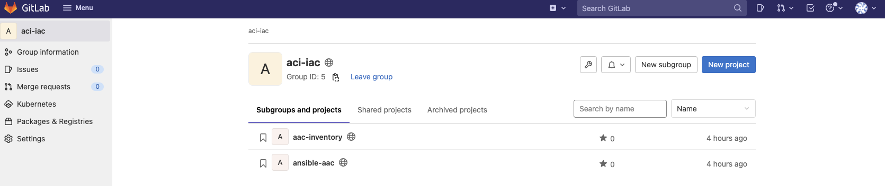
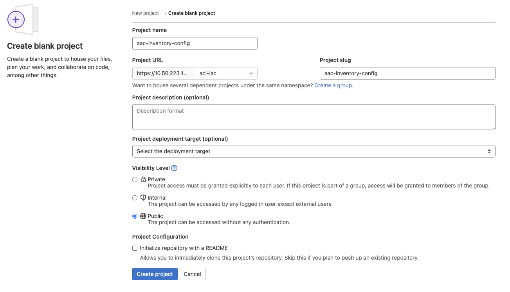
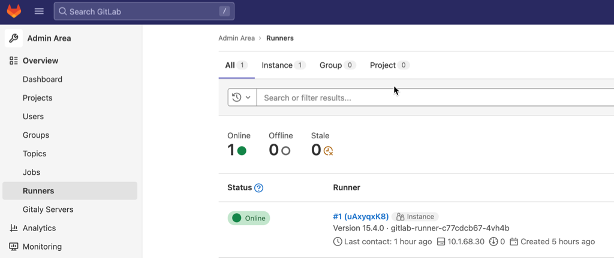
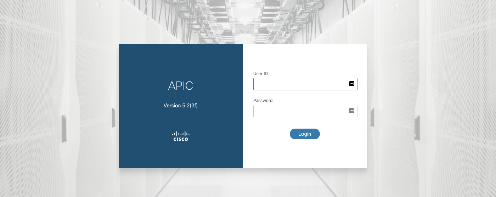

# Run Ansible AAC manually

## Goal

Get familar with Ansible AAC and be able to run it manually against an ACI Simulator

## Pre-requisites

- Use an IDE of your choice. This tutorial will assume Visual Studio Code
- Git installed
- Access to GitLab server
- Access to ACI Simulator

## Time Estimate

1h

## Lab Overview and Credentials

Each Lab pod will operate as a self contained unit consisting of the following components:

- 1x Control VM hosting the required software components (Git, Ansible, Robot, CI/CD Platform, etc.) that the ACI as Code solution are build upon
- 1x ACI Simulator

You will be able to access the instances on the following addresses:

- GitLab: <https://CONTROLLER_IP>
- ACI simulator: <https://APIC_IP>

The control VM and ACI simulator can be accessed using the following credentials.

| VM         | Username | Password |
| ---------- | -------- | -------- |
| Control VM | lab      | cisco123 |
| ACI Sim    | admin    | cisco123 (before bootstrap), C1sco123 (after bootstrap) |

## Access Control VM

Start by accessing your control vm using SSH. Once logged in, you can check if all services are healthy using the `kubectl` command.

```sh
control-vm:~$ kubectl get pods
NAME                                             READY   STATUS      RESTARTS   AGE
gitlab-webservice-default-76968dd957-lq8pl       0/2     Pending     0          40h
gitlab-certmanager-57c4557849-kw6vk              1/1     Running     0          40h
gitlab-certmanager-webhook-59d745756c-wqj9l      1/1     Running     0          40h
gitlab-redis-master-0                            2/2     Running     0          40h
gitlab-kas-668bb7c6c8-rjmqt                      1/1     Running     0          40h
gitlab-kas-668bb7c6c8-vw97d                      1/1     Running     0          40h
gitlab-gitlab-exporter-76c79db89d-fg8x5          1/1     Running     0          40h
gitlab-prometheus-server-77b5cc946-4rq29         2/2     Running     0          40h
gitlab-registry-7bd7cb55f7-h5d9f                 1/1     Running     0          40h
gitlab-gitlab-shell-7bdbc9c9b4-5lrwc             1/1     Running     0          40h
gitlab-minio-864888b9fb-sqlbz                    1/1     Running     0          40h
gitlab-toolbox-8559cc9d45-cfnrq                  1/1     Running     0          40h
gitlab-postgresql-0                              2/2     Running     0          40h
gitlab-registry-7bd7cb55f7-vmx99                 1/1     Running     0          40h
gitlab-gitlab-shell-7bdbc9c9b4-6cnfb             1/1     Running     0          40h
gitlab-gitaly-0                                  1/1     Running     0          40h
gitlab-sidekiq-all-in-1-v2-79fb64b6fb-9q9wd      1/1     Running     1          40h
gitlab-certmanager-cainjector-74cbc84b8b-mbc72   1/1     Running     4          40h
gitlab-webservice-default-76968dd957-djllh       2/2     Running     1          40h
ansible-aac                                      1/1     Running     0          20h
gitlab-minio-create-buckets-3-5c9kd              0/1     Completed   0          16h
gitlab-issuer-3-jksrg                            0/1     Completed   0          16h
gitlab-gitlab-runner-64b55d4869-6gq7z            1/1     Running     0          16h
gitlab-migrations-3-5h2kj                        0/1     Completed   0          16h
```

## Access GitLab

Go to the GitLab instance at <https://CONTROLLER_IP>. Login with the credentials listed [earlier](#lab-overview-and-credentials)



The following repositories have been created during the lab provisioning process:

- **aac-inventory**: contains a sample repository representing the desired state of the ACI configuration. This repo is available at <https://CONTROLLER_IP/aci-iac/aac-inventory>
- **ansible-aac**: contains the ACI as Code framework consisting of Ansible collection, modules, plugins being used by the aac-inventory repository. This repo is available at <https://CONTROLLER_IP/aci-iac/ansible-aac>
- **terraform-aac**: contains the ACI as Code framework consisting of Terraform, modules, plugins being used by the aac-inventory repository. This repo will **not** be used in this lab guide althrough it is available at <https://CONTROLLER_IP/aci-iac/terraform-aac>

## Create repository for rendered config

We will need to create a fourth repository to contain a rendered copy of our configuration.

Once logged in to your GitLab instance, click on `New Project` and choose `Create blank project`. Use `aac-inventory-config` as the project name and ensure you set the organization to `aci-iac` in the Project URL. See below screenshot for an example.



This will create an empty repository called `aac-inventory-config` which will be required later to store a rendered copy of our configuration.

## Verify GitLab Runner

GitLab Runner is an easy-to-use CICD system that comes with GitLab.

The lab infrastructure comes with a pre-installed runner instance, so no additional configuration as such is required. It is however always a good idea to check if the runner instance has successfully registered itself with GitLab.

Once logged in to your GitLab instance, access the `Main menu` and choose `Admin` to enter the Admin Area.

Within the Admin Area, click on `Runners` and verify that the pre-installed runner instance is online and registered correctly.



## Verify ACI Simulator

Go to the ACI simulator on `https://APIC_IP`. You should be able to see the login screen. Login with the credentials listed [earlier](#lab-overview-and-credentials)



## Clone aac-inventory locally

Go to the aac-inventory repo (<https://CONTROLLER_IP/aci-iac/aac-inventory>) and click on the `Clone` dropdown. Take note of the `Clone with HTTPS` value.


Clone the repository locally in a directory of your choice.

```sh
local-laptop:~$ git -c http.sslVerify=false clone https://CONTROLLER_IP/aci-iac/aac-inventory
Cloning into 'aac-inventory'...
warning: redirecting to https://CONTROLLER_IP/aci-iac/aac-inventory.git/
remote: Enumerating objects: 208, done.
remote: Total 208 (delta 0), reused 0 (delta 0), pack-reused 208
Receiving objects: 100% (208/208), 43.66 KiB | 698.00 KiB/s, done.
Resolving deltas: 100% (92/92), done.
```

This will make the `aac-inventory` repository available locally. Open up the folder in your favorite IDE (e.g. Visual Studio, PyCharm...). All changes described in the next section will be made on the local copy of this repository.

**PLEASE NOTE** that as the GitLab instance is using a self-signed certificate it is required to disable certificate validation when executing
the git command. This can be done using either a command line argument as in the example above or by disabling this in the global git
configuration with the following command. It is however not advised disabling SSL verification globally as this **will introduce a security risk**
and should only be used temporarily.

## Start Ansible AAC container on Control VM

To miminze the dependencies on your local machine we will use a container on the control VM to execute Ansible. We will start the container by using the following `kubectl` command.

```sh
control-vm:~$ kubectl run ansible-aac --image=danischm/aac:0.5.1 sleep infinity
pod/ansible-aac created
````

Once the container pod has been started, you can access the prompt inside the container using the following command.

```sh
control-vm:~$ kubectl exec -it ansible-aac -- bash
root@ansible-aac:/#
```

## Clone aac-inventory repository

Once the Ansible AAC container has been started, it is time to clone the `aac-inventory` repository inside the container.

```sh
root@ansible-aac:/# git -c http.sslVerify=false clone https://CONTROLLER_IP/aci-iac/aac-inventory
Cloning into 'aac-inventory'...
warning: redirecting to https://CONTROLLER_IP/aci-iac/aac-inventory.git/
remote: Enumerating objects: 656, done.
remote: Counting objects: 100% (44/44), done.
remote: Compressing objects: 100% (31/31), done.
remote: Total 656 (delta 14), reused 32 (delta 8), pack-reused 612
Receiving objects: 100% (656/656), 97.64 KiB | 6.51 MiB/s, done.
Resolving deltas: 100% (354/354), done.

root@ansible-aac:/# cd aac-inventory/
root@ansible-aac:/aac-inventory# ls
README.md            apic_deploy.yaml   apic_test.yaml      data                ndo_test.yaml      requirements.yml
ansible.cfg          apic_nae_pca.yaml  apic_validate.yaml  ndo_bootstrap.yaml  ndo_validate.yaml  test_apic_bootstrap.yaml
apic_bootstrap.yaml  apic_render.yaml   bin                 ndo_deploy.yaml     requirements.txt
````

We now have two local clones of the aac-inventory repository, one on your local laptop and one within the Ansible AAC container. The next steps can in theory be done in either of these two places, but as you only have a code editor on your laptop will we modify the there and then use Git commit/push/pull to get the changes reflected in the AAC container.

## Install required software packages

Before Ansible AAC can be executed it is required to install the `ansible-aac` collection which is not included in the container image.

```sh
root@ansible-aac:/aac-inventory# pwd
/aac-inventory
root@ansible-aac:/aac-inventory# ansible-galaxy install -r requirements.yml
Starting galaxy collection install process
Process install dependency map
Cloning into '/root/.ansible/tmp/ansible-local-29m57eytin/tmphlj0sx10/ansible-aacjlq36f28'...
remote: Enumerating objects: 8055, done.
remote: Counting objects: 100% (1062/1062), done.
remote: Compressing objects: 100% (283/283), done.
remote: Total 8055 (delta 596), reused 1017 (delta 578), pack-reused 6993
Receiving objects: 100% (8055/8055), 2.41 MiB | 2.08 MiB/s, done.
Resolving deltas: 100% (4915/4915), done.
Already on 'master'
Your branch is up to date with 'origin/master'.
Starting collection install process
Installing 'cisco.aac:0.4.0' to '/aac-inventory/ansible_collections/cisco/aac'
Downloading https://galaxy.ansible.com/download/ansible-posix-1.4.0.tar.gz to /root/.ansible/tmp/ansible-local-29m57eytin/tmphlj0sx10/ansible-posix-1.4.0-tpxa9k6y
Created collection for cisco.aac:0.4.0 at /aac-inventory/ansible_collections/cisco/aac
cisco.aac:0.4.0 was installed successfully
Installing 'ansible.posix:1.4.0' to '/aac-inventory/ansible_collections/ansible/posix'
Downloading https://galaxy.ansible.com/download/cisco-nae-1.0.1.tar.gz to /root/.ansible/tmp/ansible-local-29m57eytin/tmphlj0sx10/cisco-nae-1.0.1-bd6a8qd6
ansible.posix:1.4.0 was installed successfully
Installing 'cisco.nae:1.0.1' to '/aac-inventory/ansible_collections/cisco/nae'
Downloading https://galaxy.ansible.com/download/cisco-aci-2.3.0.tar.gz to /root/.ansible/tmp/ansible-local-29m57eytin/tmphlj0sx10/cisco-aci-2.3.0-3keyiv1j
cisco.nae:1.0.1 was installed successfully
Installing 'cisco.aci:2.3.0' to '/aac-inventory/ansible_collections/cisco/aci'
Downloading https://galaxy.ansible.com/download/cisco-mso-2.1.0.tar.gz to /root/.ansible/tmp/ansible-local-29m57eytin/tmphlj0sx10/cisco-mso-2.1.0-kwcmmulo
cisco.aci:2.3.0 was installed successfully
Installing 'cisco.mso:2.1.0' to '/aac-inventory/ansible_collections/cisco/mso'
Downloading https://galaxy.ansible.com/download/community-vmware-3.1.0.tar.gz to /root/.ansible/tmp/ansible-local-29m57eytin/tmphlj0sx10/community-vmware-3.1.0-ind5bz6k
cisco.mso:2.1.0 was installed successfully
Installing 'community.vmware:3.1.0' to '/aac-inventory/ansible_collections/community/vmware'
Downloading https://galaxy.ansible.com/download/community-general-6.0.0.tar.gz to /root/.ansible/tmp/ansible-local-29m57eytin/tmphlj0sx10/community-general-6.0.0-2ylvu_gg
community.vmware:3.1.0 was installed successfully
Installing 'community.general:6.0.0' to '/aac-inventory/ansible_collections/community/general'
Downloading https://galaxy.ansible.com/download/ansible-netcommon-4.1.0.tar.gz to /root/.ansible/tmp/ansible-local-29m57eytin/tmphlj0sx10/ansible-netcommon-4.1.0-57wfrhj5
community.general:6.0.0 was installed successfully
Installing 'ansible.netcommon:4.1.0' to '/aac-inventory/ansible_collections/ansible/netcommon'
Downloading https://galaxy.ansible.com/download/ansible-utils-2.7.0.tar.gz to /root/.ansible/tmp/ansible-local-29m57eytin/tmphlj0sx10/ansible-utils-2.7.0-2_p698mb
ansible.netcommon:4.1.0 was installed successfully
Installing 'ansible.utils:2.7.0' to '/aac-inventory/ansible_collections/ansible/utils'
ansible.utils:2.7.0 was installed successfully
```

Note that the `ansible-aac` collection by default is installed from the master ansible-aac repository on Github (wwwin-github.cisco.com) and not the copy available inside the lab pod. If you want to use the one inside your lab pod, then edit the `requirements.yml` file and point it at your respective repository instead.

```sh
root@ansible-aac:/aac-inventory# cat requirements.yml
---
collections:
  - name: https://wwwin-github.cisco.com/aac/ansible-aac.git
    type: git
    version: master
```

With the `ansible-aac` collection installed we are now ready to start deploying configuration onto the ACI simulator.

## Customize inventory files

We need to change the `hosts.yaml` file which can be found in the `aac-inventory/data/lab/` folder. Do The `APIC_HOST` is read from an environment variable which we will define before running the playbooks.

Modify the `hosts.yaml` file, using the copy of the repository on your laptop, so that it looks like the one below. This lab guide focuses only on APIC, which is why we are commenting out the NDO section.

```yaml
---
aci:
  children:
    apic:
      hosts:
        apic1:
          apic_host: "{{ lookup('ansible.builtin.env', 'APIC_HOST') }}"
          ansible_connection: local
    # ndo:
    #   hosts:
    #     ndo1:
    #       ndo_host: "{{ lookup('ansible.builtin.env', 'MSO_HOST') }}"
    #       ansible_connection: local
```

In addition to `hosts.yaml`, we also need to modify the `bootstrap.yaml` file, which can be found in the `aac-inventory/data/lab/host_vars/apic1` folder. Make the following changes so that the admin password matches the APIC password for the lab. You should have something similar to below example:

```yaml
---
apic:
  bootstrap:
    admin_username: admin
    admin_password: cisco123
    config_passphrase: C1sco123C1sco123
```

The `admin_password` variable must be specified in order for the AAC Bootstrap functionality to work later in this lab guide. If bootstrap is done manually, then the `admin_username` and `admin_password` configuration can be removed alltogether.

**PLEASE NOTE** that the admin password are changed as part AAC Bootstrap. The new  admin password is specified using the `apic_admin_password` attribute in the `data/lab/group_vars/aci.yaml` file.

Since we only use an APIC configuration, you can choose to remove the `aac-inventory/data/lab/host_vars/ndo1` directory, but this is not strictly required as we will only be using the APIC related playbooks.

The desired ACI configuration are specified in the YAML files located in the `aac-inventory/data/lab/host_vars/apic1` directory. Take some time to look at the content of the files before proceeding.

In order to commit the local changes to the local copy of the repository and push the changes to the remote repository, the following commands are required.

```sh
local-laptop:~/aac-inventory$ git add .
local-laptop:~/aac-inventory$ git commit -m "Customize inventory for aac lab environment"
local-laptop:~/aac-inventory$ git -c http.sslVerify=false push origin master
```

With the changes pushed to the remote repository is it time to pull these changes into the AAC container. This is done using the following command.

```sh
root@ansible-aac:/aac-inventory# git -c http.sslVerify=false pull
```

## ACI as Code Validation Stage

With the inventory updated inside the Ansible AAC container, it is time to start using ACI as Code. The first task we will perform is the pre-deployment validation, which runs a set of syntax and semantic checks against our desired configuration.

The validation checks are performed using the `cisco.aac.apic_validate` Ansible role.

Execute the validation tests by running the `apic_validate.yaml` playbook. The two environment variables at the top of the output above are required in order for the playbook to run as expected.

```sh
export ANSIBLE_VAULT_PASSWORD=dummy_value
export ANSIBLE_CONFIG=$(pwd)/ansible.cfg

root@ansible-aac:/aac-inventory# cat apic_validate.yaml
---
- name: Validate APIC Data
  hosts: apic
  gather_facts: no

  tasks:
    - name: Validate APIC Data
      include_role:
        name: cisco.aac.apic_validate

root@ansible-aac:/aac-inventory# ansible-playbook -i data/lab/hosts.yaml apic_validate.yaml

PLAY [Validate APIC Data] *************************************************************************************************************

TASK [Validate APIC Data] *************************************************************************************************************

TASK [cisco.aac.apic_validate : Validate APIC Data] ***********************************************************************************
changed: [apic1]

PLAY RECAP ****************************************************************************************************************************
apic1                      : ok=1    changed=1    unreachable=0    failed=0    skipped=0    rescued=0    ignored=0
```

In case you hit a validation issue, then resolve this one and re-run the validation playbook before proceeding.

If you do not hit a validation issue, then edit one of the desired config files located in the `aac-inventory/data/lab/host_vars/apic1` directory and make an obvious syntax or semantic error and then re-run the validation playbook and see the output. An example of an obvious error to introduce could be a Physical Domain referencing a VLAN pool that does not exist.

Once you have inspected the output with error(s) introduced in the desired configuration, then revert or fix these error(s) before proceeding.

## ACI as Code Bootstrap Stage

As we [specified](#customize-inventory-files) in the `hosts.yaml` file, we will use an environment variable to define the IP address of the ACI simulator. This variable therefore needs to be specified.

```sh
root@ansible-aac:/aac-inventory# export APIC_HOST=<REPLACE WITH IP OF ACI Simulator>
```

With this environment variable set, we are ready to bootstrap the APIC controller - i.e. configure the local user accounts that AAC will use for deployment and testing.

```sh
root@ansible-aac:/aac-inventory# ansible-playbook -i data/lab/hosts.yaml apic_bootstrap.yaml

PLAY [APIC Bootstrap] *********************************************************************************************************************************************************************

TASK [APIC Bootstrap] *********************************************************************************************************************************************************************

TASK [Load Variables] *********************************************************************************************************************************************************************

TASK [cisco.aac.apic_bootstrap : Delete existing ansible user] ****************************************************************************************************************************
ok: [apic1]

TASK [cisco.aac.apic_bootstrap : Add ansible user] ****************************************************************************************************************************************
changed: [apic1]

TASK [cisco.aac.apic_bootstrap : Add domain to ansible user] ******************************************************************************************************************************
changed: [apic1]

TASK [cisco.aac.apic_bootstrap : Add cert to ansible user] ********************************************************************************************************************************
changed: [apic1]

TASK [cisco.aac.apic_bootstrap : Delete existing test user] *******************************************************************************************************************************
ok: [apic1]

TASK [cisco.aac.apic_bootstrap : Add test user] *******************************************************************************************************************************************
changed: [apic1]

TASK [cisco.aac.apic_bootstrap : Add domain to test user] *********************************************************************************************************************************
changed: [apic1]

TASK [cisco.aac.apic_bootstrap : Delete existing ndo user] ********************************************************************************************************************************
skipping: [apic1]

TASK [cisco.aac.apic_bootstrap : Add ndo user] ********************************************************************************************************************************************
skipping: [apic1]

TASK [cisco.aac.apic_bootstrap : Add domain to ndo user] **********************************************************************************************************************************
skipping: [apic1]

TASK [cisco.aac.apic_bootstrap : Configure encryption passphrase for config import/export] ************************************************************************************************
changed: [apic1]

TASK [cisco.aac.apic_bootstrap : Update admin user password] ******************************************************************************************************************************
skipping: [apic1]

TASK [cisco.aac.apic_bootstrap : Delete default objects] **********************************************************************************************************************************

PLAY RECAP ********************************************************************************************************************************************************************************
apic1                      : ok=8    changed=6    unreachable=0    failed=0    skipped=5    rescued=0    ignored=0
```

With the fabric bootstrap completed, we are ready to verify if the expected user accounts have been created and that they have the expected privileges.

**PLEASE NOTE** that the admin password are changed as part AAC Bootstrap. The new  admin password is specified using the `apic_admin_password` attribute in the `data/lab/group_vars/aci.yaml` file.

To do this will we create a playbook (`test_apic_bootstrap.yaml`) that should look like this:

```yaml
---
- name: Test APIC Bootstrap
  hosts: apic
  gather_facts: no

  tasks:
    - name: APIC Bootstrap Tests
      include_role:
        name: cisco.aac.test_apic_bootstrap
```

Note: If you create this playbook on your local laptop, then remember to commit it to git and update the local repository within the ansible-aac container.

Once the playbook is present inside the container is it time to execute bootstrap testing.

```sh
root@ansible-aac:/aac-inventory# ansible-playbook -i data/lab/hosts.yaml test_apic_bootstrap.yaml

PLAY [Test APIC Bootstrap] ****************************************************************************************************************************************************************

TASK [APIC Bootstrap Tests] ***************************************************************************************************************************************************************

TASK [Load Common Variables] **************************************************************************************************************************************************************

TASK [Load Variables] *********************************************************************************************************************************************************************

TASK [cisco.aac.test_apic_bootstrap : Create Root Directory] ******************************************************************************************************************************
ok: [apic1]

TASK [cisco.aac.test_apic_bootstrap : Create Test Results Directory] **********************************************************************************************************************
ok: [apic1]

TASK [Render Apic Common] *****************************************************************************************************************************************************************

TASK [cisco.aac.apic_common : RENDER TEST : Apic Common] **********************************************************************************************************************************
ok: [apic1]

TASK [cisco.aac.test_apic_bootstrap : RENDER TEST : Bootstrap] ****************************************************************************************************************************
ok: [apic1]

TASK [cisco.aac.test_apic_bootstrap : Run Tests] ******************************************************************************************************************************************
changed: [apic1]

PLAY RECAP ********************************************************************************************************************************************************************************
apic1                      : ok=5    changed=1    unreachable=0    failed=0    skipped=0    rescued=0    ignored=0
```

Robot Framework is used to executed the automated testing and the test results are written to the `test_results` directory.

```sh
root@ansible-aac:/aac-inventory# ls test_results/lab/apic1/
bootstrap_log.html  bootstrap_output.xml  bootstrap_report.html  bootstrap_xunit.xml
```

## ACI as Code Render Stage

With the APIC bootstrap complete, it is time to render the desired configuration changes to the ACI fabric in order to have the configuration matching the desired configuration in the inventory.

Since the inventory configuration in `data/lab/group_vars/aci.yaml` is configured with `apic_mode: only_changed` and at this point we do not have any previous state we should change the `apic_mode` to `all`.

```sh
root@ansible-aac:/aac-inventory# cat apic_render.yaml
---
- name: Render APIC model
  hosts: apic
  gather_facts: no
  vars:
    apic_render: True
    apic_option_render: True
    apic_option_configure: False
    apic_option_delete: False

  tasks:
    - name: APIC Render
      include_role:
        name: cisco.aac.apic_deploy
      when: apic_render

root@ansible-aac:/aac-inventory# ansible-playbook -i data/lab/hosts.yaml apic_render.yaml

PLAY [Render APIC model] **************************************************************************************************************

TASK [APIC Render] ********************************************************************************************************************

TASK [Load Common Variables] **********************************************************************************************************

TASK [Load Variables] *****************************************************************************************************************

TASK [cisco.aac.apic_deploy : Get APIC Changed Objects] *******************************************************************************
changed: [apic1]

TASK [cisco.aac.apic_deploy : Create Directories] *************************************************************************************

TASK [cisco.aac.apic_deploy : Create Spine Directories] *******************************************************************************

TASK [cisco.aac.apic_deploy : Create Leaf Directories] ********************************************************************************

TASK [cisco.aac.apic_deploy : Create Tenant Directories] ******************************************************************************
changed: [apic1] => (item=PROD)

TASK [Render Stage] *******************************************************************************************************************

TASK [cisco.aac.apic_common : RENDER : TENANT PROD : Bridge Domain] *******************************************************************
changed: [apic1]

TASK [Configure Stage] ****************************************************************************************************************
skipping: [apic1] => (item=[{'name': 'Bridge Domain', 'template': 'bridge_domain', 'folder': 'tenants', 'aci_classes': ['fvBD'], 'delete_ignore': ['inb'], 'scope': ['user', 'mgmt'], 'test_types': ['config', 'health'], 'paths': ['apic.tenants.bridge_domains']}, '', 'PROD'])

TASK [Delete Stage] *******************************************************************************************************************
skipping: [apic1] => (item=[{'name': 'Bridge Domain', 'template': 'bridge_domain', 'folder': 'tenants', 'aci_classes': ['fvBD'], 'delete_ignore': ['inb'], 'scope': ['user', 'mgmt'], 'test_types': ['config', 'health'], 'paths': ['apic.tenants.bridge_domains']}, '', 'PROD'])

PLAY RECAP ****************************************************************************************************************************
apic1                      : ok=3    changed=3    unreachable=0    failed=0    skipped=5    rescued=0    ignored=0
```

The `apic_render.yaml` playbook will render the respective JSON payloads to be later used in the deploy phase. This output can be found in the `rendered` directory.

```sh
root@ansible-aac:/aac-inventory# ls rendered/lab/apic1/
bootstrap_tests  config
root@ansible-aac:/aac-inventory# ls -l rendered/lab/apic1/config/tenants/PROD/
total 164
-rw-r--r-- 1 root root  513 Jan  6 00:57 application_profile.json
-rw-r--r-- 1 root root  155 Jan  6 00:57 bfd_interface_policy.json
-rw-r--r-- 1 root root  155 Jan  6 00:57 bgp_address_family_context_policy.json
<snip>
```

Before proceeding, spend some time and look at the content of the rendered configuration.

## ACI as Code Render Deploy

With the required configuration changes rendered, it is time to deploy these configuration changes to the ACI fabric. This is done using the `apic_deploy.yaml` playbook.

```sh
root@ansible-aac:/aac-inventory# cat apic_deploy.yaml
---
- name: Deploy APIC model
  hosts: apic
  gather_facts: no
  vars:
    apic_snapshot: True
    apic_deploy: True
    apic_option_render: False
    apic_option_configure: True
    apic_option_delete: True

  tasks:
    - name: APIC Snapshot
      include_role:
        name: cisco.aac.apic_snapshot
      when: apic_snapshot

    - name: APIC Deploy
      include_role:
        name: cisco.aac.apic_deploy
      when: apic_deploy

root@ansible-aac:/aac-inventory# ansible-playbook -i data/lab/hosts.yaml apic_deploy.yaml

PLAY [Deploy APIC model] **************************************************************************************************************

TASK [APIC Snapshot] ******************************************************************************************************************

TASK [Load Variables] *****************************************************************************************************************

TASK [cisco.aac.apic_snapshot : Create Snapshot] **************************************************************************************
changed: [apic1]

TASK [APIC Deploy] ********************************************************************************************************************

TASK [Load Common Variables] **********************************************************************************************************

TASK [Load Variables] *****************************************************************************************************************

TASK [cisco.aac.apic_deploy : Get APIC Changed Objects] *******************************************************************************
changed: [apic1]

TASK [cisco.aac.apic_deploy : Create Directories] *************************************************************************************

TASK [cisco.aac.apic_deploy : Create Spine Directories] *******************************************************************************

TASK [cisco.aac.apic_deploy : Create Leaf Directories] ********************************************************************************

TASK [cisco.aac.apic_deploy : Create Tenant Directories] ******************************************************************************
ok: [apic1] => (item=PROD)

TASK [Render Stage] *******************************************************************************************************************
skipping: [apic1] => (item=[{'name': 'Bridge Domain', 'template': 'bridge_domain', 'folder': 'tenants', 'aci_classes': ['fvBD'], 'delete_ignore': ['inb'], 'scope': ['user', 'mgmt'], 'test_types': ['config', 'health'], 'paths': ['apic.tenants.bridge_domains']}, '', 'PROD'])

TASK [Configure Stage] ****************************************************************************************************************

TASK [cisco.aac.apic_common : CONFIGURE : TENANT PROD : Bridge Domain] ****************************************************************
changed: [apic1]

TASK [Delete Stage] *******************************************************************************************************************

TASK [cisco.aac.apic_common : DELETE : TENANT PROD : Bridge Domain] *******************************************************************
ok: [apic1]

PLAY RECAP ****************************************************************************************************************************
apic1                      : ok=5    changed=3    unreachable=0    failed=0    skipped=4    rescued=0    ignored=0
```

Once the configuration changes have been applied to the ACI fabric, this can be verified through using the APIC GUI.

## ACI as Code Testing Stage

Performing manual verification of configuration changes is naturally not a scalable solution, which is why automated testing is available in ACI as Code.

Similar to configuration rendering and deployment, we can also limit the testing to only test the modified objects in ACI based on the current ACI as Code configuration (`apic_mode`). In our case we will unconditionally render and execute all test, `apic_mode = all`.

Testing itself is performed using the `apic_test.yaml` playbook, which selects the required test templates, renders these against the modified configuration, and then lastly executes the tests.

```sh
root@ansible-aac:/aac-inventory# ansible-playbook -i data/lab/hosts.yaml apic_test.yaml

PLAY [APIC Tests] *********************************************************************************************************************

TASK [APIC Tests] *********************************************************************************************************************

TASK [Load Common Variables] **********************************************************************************************************

TASK [Load Variables] *****************************************************************************************************************

TASK [cisco.aac.test_apic_deploy : Get APIC Changed Objects] **************************************************************************
changed: [apic1]

TASK [cisco.aac.test_apic_deploy : Create Root Directory] *****************************************************************************
changed: [apic1]

TASK [cisco.aac.test_apic_deploy : Create Directories] ********************************************************************************
changed: [apic1] => (item=config/fabric_policies)
changed: [apic1] => (item=health/fabric_policies)
changed: [apic1] => (item=operational/fabric_policies)
changed: [apic1] => (item=config/pod_policies)
changed: [apic1] => (item=health/pod_policies)
changed: [apic1] => (item=config/access_policies)
changed: [apic1] => (item=health/access_policies)
changed: [apic1] => (item=config/tenants)
changed: [apic1] => (item=health/tenants)

TASK [cisco.aac.test_apic_deploy : Create Spine Directories] **************************************************************************

TASK [cisco.aac.test_apic_deploy : Create Leaf Directories] ***************************************************************************

TASK [cisco.aac.test_apic_deploy : Create Tenant Directories] *************************************************************************
changed: [apic1] => (item=config/tenants/PROD)
changed: [apic1] => (item=health/tenants/PROD)
changed: [apic1] => (item=operational/tenants/PROD)

TASK [cisco.aac.test_apic_deploy : Create Test Results Directory] *********************************************************************
ok: [apic1]

TASK [Render Apic Common] *************************************************************************************************************

TASK [cisco.aac.apic_common : RENDER TEST : Apic Common] ******************************************************************************
changed: [apic1]

TASK [Render Tests] *******************************************************************************************************************

TASK [cisco.aac.apic_common : RENDER TEST : HEALTH : TACACS Provider] *****************************************************************
changed: [apic1]

TASK [cisco.aac.apic_common : RENDER TEST : HEALTH : Remote Location] *****************************************************************
changed: [apic1]

TASK [cisco.aac.apic_common : RENDER TEST : HEALTH : Config Exports] ******************************************************************
changed: [apic1]

TASK [cisco.aac.apic_common : RENDER TEST : OPERATIONAL : Config Exports] *************************************************************
changed: [apic1]

TASK [cisco.aac.apic_common : RENDER TEST : HEALTH : Pod Setup] ***********************************************************************
changed: [apic1]

TASK [cisco.aac.apic_common : RENDER TEST : HEALTH : Date and Time Policy] ************************************************************
changed: [apic1]

TASK [cisco.aac.apic_common : RENDER TEST : OPERATIONAL : BGP Policy] *****************************************************************
changed: [apic1]

TASK [cisco.aac.apic_common : RENDER TEST : HEALTH : Fabric Leaf Switch Profile] ******************************************************
changed: [apic1]

TASK [cisco.aac.apic_common : RENDER TEST : HEALTH : Fabric Spine Switch Profile] *****************************************************
changed: [apic1]

TASK [cisco.aac.apic_common : RENDER TEST : HEALTH : Fabric Leaf Interface Profile] ***************************************************
changed: [apic1]

TASK [cisco.aac.apic_common : RENDER TEST : HEALTH : Fabric Spine Interface Profile] **************************************************
changed: [apic1]

TASK [cisco.aac.apic_common : RENDER TEST : HEALTH : Pod Profile] *********************************************************************
changed: [apic1]

TASK [cisco.aac.apic_common : RENDER TEST : HEALTH : External Connectivity Policy] ****************************************************
changed: [apic1]

TASK [cisco.aac.apic_common : RENDER TEST : HEALTH : VMware VMM Domain] ***************************************************************
changed: [apic1]

TASK [cisco.aac.apic_common : RENDER TEST : HEALTH : Fabric SPAN Source Group] ********************************************************
changed: [apic1]

TASK [cisco.aac.apic_common : RENDER TEST : HEALTH : Fabric SPAN Destination Group] ***************************************************
changed: [apic1]

TASK [cisco.aac.apic_common : RENDER TEST : HEALTH : Access Leaf Switch Profile] ******************************************************
changed: [apic1]

TASK [cisco.aac.apic_common : RENDER TEST : HEALTH : Access Spine Switch Profile] *****************************************************
changed: [apic1]

TASK [cisco.aac.apic_common : RENDER TEST : HEALTH : Access Leaf Interface Profile] ***************************************************
changed: [apic1]

TASK [cisco.aac.apic_common : RENDER TEST : HEALTH : Access FEX Interface Profile] ****************************************************
changed: [apic1]

TASK [cisco.aac.apic_common : RENDER TEST : HEALTH : Access Spine Interface Profile] **************************************************
changed: [apic1]

TASK [cisco.aac.apic_common : RENDER TEST : HEALTH : Physical Domain] *****************************************************************
changed: [apic1]

TASK [cisco.aac.apic_common : RENDER TEST : HEALTH : Routed Domain] *******************************************************************
changed: [apic1]

TASK [cisco.aac.apic_common : RENDER TEST : HEALTH : AAEP] ****************************************************************************
changed: [apic1]

TASK [cisco.aac.apic_common : RENDER TEST : HEALTH : Access SPAN Destination Group] ***************************************************
changed: [apic1]

TASK [cisco.aac.apic_common : RENDER TEST : HEALTH : Access SPAN Source Group] ********************************************************
changed: [apic1]

TASK [cisco.aac.apic_common : RENDER TEST : HEALTH : VSPAN Destination Group] *********************************************************
changed: [apic1]

TASK [cisco.aac.apic_common : RENDER TEST : HEALTH : VSPAN Session] *******************************************************************
changed: [apic1]

TASK [cisco.aac.apic_common : RENDER TEST : HEALTH : Tenant] **************************************************************************
changed: [apic1]

TASK [cisco.aac.apic_common : RENDER TEST : TENANT PROD : HEALTH : VRF] ***************************************************************
changed: [apic1]

TASK [cisco.aac.apic_common : RENDER TEST : TENANT PROD : CONFIG : Bridge Domain] *****************************************************
changed: [apic1]

TASK [cisco.aac.apic_common : RENDER TEST : TENANT PROD : HEALTH : Bridge Domain] *****************************************************
changed: [apic1]

TASK [cisco.aac.apic_common : RENDER TEST : TENANT PROD : HEALTH : L3out] *************************************************************
changed: [apic1]

TASK [cisco.aac.apic_common : RENDER TEST : TENANT PROD : OPERATIONAL : L3out] ********************************************************
changed: [apic1]

TASK [cisco.aac.apic_common : RENDER TEST : TENANT PROD : HEALTH : External Endpoint Group] *******************************************
changed: [apic1]

TASK [cisco.aac.apic_common : RENDER TEST : TENANT PROD : HEALTH : Application Profile] ***********************************************
changed: [apic1]

TASK [cisco.aac.apic_common : RENDER TEST : TENANT PROD : HEALTH : Endpoint Group] ****************************************************
changed: [apic1]

TASK [cisco.aac.apic_common : RENDER TEST : TENANT PROD : HEALTH : Endpoint Security Group] *******************************************
changed: [apic1]

TASK [cisco.aac.apic_common : RENDER TEST : TENANT PROD : HEALTH : Contract] **********************************************************
changed: [apic1]

TASK [cisco.aac.apic_common : RENDER TEST : TENANT PROD : HEALTH : Multicast Route Map] ***********************************************
changed: [apic1]

TASK [cisco.aac.apic_common : RENDER TEST : TENANT PROD : HEALTH : IGMP Snooping Policy] **********************************************
changed: [apic1]

TASK [cisco.aac.apic_common : RENDER TEST : TENANT PROD : HEALTH : IGMP Interface Policy] *********************************************
changed: [apic1]

TASK [cisco.aac.apic_common : RENDER TEST : TENANT PROD : HEALTH : IP SLA Policy] *****************************************************
changed: [apic1]

TASK [cisco.aac.apic_common : RENDER TEST : TENANT PROD : HEALTH : Tenant SPAN Source Group] ******************************************
changed: [apic1]

TASK [cisco.aac.apic_common : RENDER TEST : TENANT PROD : HEALTH : Tenant SPAN Destination Group] *************************************
changed: [apic1]

TASK [cisco.aac.apic_common : RENDER TEST : TENANT PROD : HEALTH : Redirect Policy] ***************************************************
changed: [apic1]

TASK [cisco.aac.apic_common : RENDER TEST : TENANT PROD : HEALTH : Redirect Backup Policy] ********************************************
changed: [apic1]

TASK [cisco.aac.apic_common : RENDER TEST : TENANT PROD : HEALTH : Redirect Health Group] *********************************************
changed: [apic1]

TASK [cisco.aac.apic_common : RENDER TEST : TENANT PROD : HEALTH : L4L7 Device] *******************************************************
changed: [apic1]

TASK [cisco.aac.apic_common : RENDER TEST : TENANT PROD : HEALTH : Service Graph Template] ********************************************
changed: [apic1]

TASK [cisco.aac.apic_common : RENDER TEST : TENANT PROD : HEALTH : Device Selection Policy] *******************************************
changed: [apic1]

TASK [cisco.aac.apic_common : RENDER TEST : TENANT PROD : HEALTH : INB Endpoint Group] ************************************************
changed: [apic1]

TASK [cisco.aac.apic_common : RENDER TEST : TENANT PROD : HEALTH : OOB Endpoint Group] ************************************************
changed: [apic1]

TASK [cisco.aac.apic_common : RENDER TEST : TENANT PROD : HEALTH : OOB External Management Instance] **********************************
changed: [apic1]

TASK [cisco.aac.apic_common : RENDER TEST : TENANT PROD : HEALTH : OOB Contract] ******************************************************
changed: [apic1]

TASK [cisco.aac.test_apic_deploy : APIC Login] ****************************************************************************************
ok: [apic1]

TASK [cisco.aac.test_apic_deploy : Save APIC Token] ***********************************************************************************
changed: [apic1]

TASK [cisco.aac.test_apic_deploy : Run Tests] *****************************************************************************************
changed: [apic1]

PLAY RECAP ****************************************************************************************************************************
apic1                      : ok=399  changed=396  unreachable=0    failed=0    skipped=0    rescued=0    ignored=0
```

Robot Framework is used to executed the automated testing and the test results are written to the `test_results` directory.

```sh
root@ansible-aac:/aac-inventory# ls test_results/lab/apic1/
bootstrap_log.html    bootstrap_report.html  log.html    pabot_results  xunit.xml
bootstrap_output.xml  bootstrap_xunit.xml    output.xml  report.html
```

As we are running Ansible AAC in a container, we need to copy off the test results in order to open them in a browser and inspect them.

## ACI as Code Saving Artifacts Stage

With the configuration changes deployed and (hopefully) successfully verified, the last outstanding task to store the relevant artifacts in preparation for next execution.

The relevant artifacts includes:

- Test Results (not saved in this lab)
- Tagging the desired configuration as `last_deploy` to enable "delta" configuration to be deployed
- Saving rendered configurations to the `aac-inventory-config` repository (optional step)

Tagging the current version of the desired configurations as the last deployed ones are done using the following git commands. The possibly existing `last_deploy` tag is first deleted and then recreated.

```sh
root@ansible-aac:/aac-inventory# git tag -d last_deploy
Deleted tag 'last_deploy' (was 8d72343)
root@ansible-aac:/aac-inventory# git -c http.sslVerify=false push --delete origin last_deploy
root@ansible-aac:/aac-inventory# git tag last_deploy
root@ansible-aac:/aac-inventory# git -c http.sslVerify=false push --tags
```

Optionally, the rendered configurations can be saved by copying the content of the `/aac-inventory/rendered/` directory into a local clone of the `aac-inventory-config` repository after which the changes are commited to git and pushed to the remote repository.

## Lab Summary

If you have followed the steps outlined in this lab guide, you have successfully used Ansible AAC to modify the configurations of your ACI simulator.
