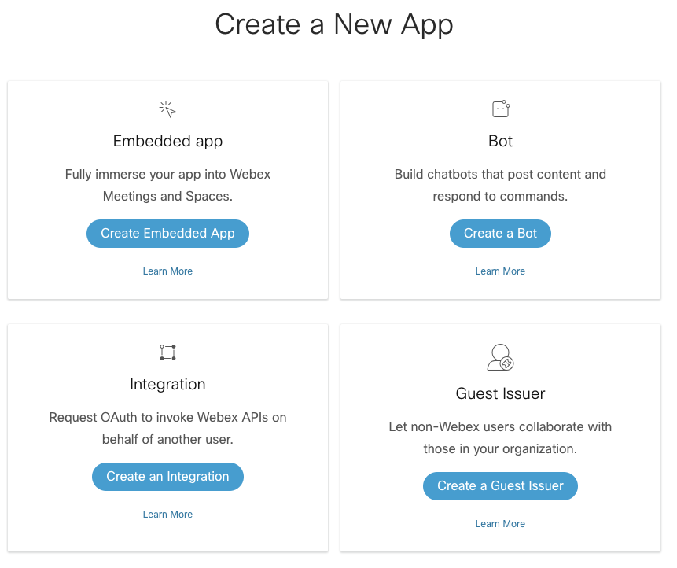
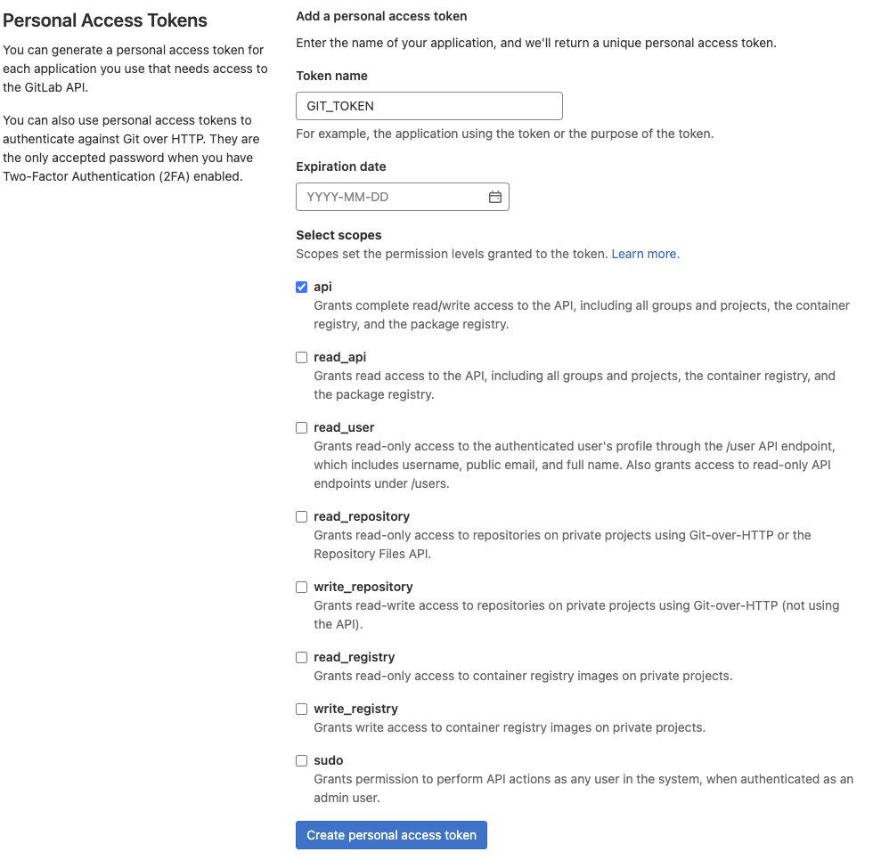
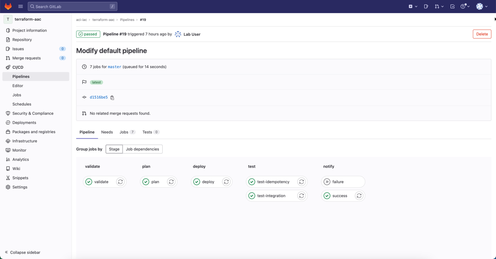

# Run Terraform AAC with CI/CD

## Goal

Integrate Terraform AAC with GitLab CI

This lab builds on top of [Run Terraform AAC manually](../guide_terraform_manual/) and it is assume that you have preferably completed this lab or at **a minimum** made it past the [Clone AAC Inventory Locally](../guide_terraform_manual/#clone-aac-inventory-locally) step.

## Pre-requisites

- Use an IDE of your choice. This tutorial will assume Visual Studio Code
- Git installed
- Access to GitLab server with GitLab Runner already pre-registered
- Access to ACI Simulator
- Basic to Intermediate understanding of Terraform AAC

## Time Estimate

2h

## Lab Overview and Credentials

Each Lab pod will operate as a self contained unit consisting of the following components:

- 1x Control VM hosting the required software components (Git, Ansible, Robot, CI/CD Platform, etc.) that the ACI as Code solution are build upon
- 1x ACI Simulator

You will be able to access the instances on the following addresses:

- GitLab: <https://CONTROLLER_IP>
- ACI simulator: <https://APIC_IP>

The control VM and ACI simulator can be accessed using the following credentials.

| VM         | Username | Password |
| ---------- | -------- | -------- |
| Control VM | lab      | cisco123 |
| ACI Sim    | admin    | cisco123 (before bootstrap), C1sco123 (after bootstrap) |

**Please note** that it is assume that you are already familiar with the lab and preferably have completed [Run Terraform AAC manually](../guide_terraform_manual/) and thereby already have verified that your lab pod is in a health condition.

## Preparing Webex Notifications

Webex will in this lab be used to send notifications to indicate the status of each pipeline build. To do this will you need to create a Webex Bot that will post these notifcations.

### Create Webex Bot

Go to <https://developer.webex.com> and login with CEC credentials. Select `My Webex Apps` and `Create a New App`.



Select `Create a bot` and fill out all required fields.

**MAKE SURE** to use a unique bot username.


Once finished, click `Add Bot` and your Webex bot will be created. You will receive a `Bot Access Token`. Copy this token as it will be required in the next section (e.g. SPARK_ACCESS_TOKEN).

### Create a Webex space

Next, we will create a Webex space. In Webex, click the `+` icon and select ``Create Space`.


**MAKE SURE** to use a unique name for your space. Then add the bot we created earlier as a member to this space.


### Retrieve Room ID

The GitLab pipeline will need to know the room ID in order to be able to send messages to it. So in the section, we will retrieve the room ID for the room we just created. There are multiple ways to do this (e.g postman, python, CURL...). In this lab guide, we will use CURL.

Log into the Controller Virtual Machine using SSH.

```sh
local-laptop:~$ ssh cisco@CONTROLLER_IP
local-laptop:~$ curl -L -X GET 'https://api.ciscospark.com/v1/rooms' -H 'Authorization: Bearer <BEARER>' | json_pp -json_opt pretty,canonical
```

In the above command, replace the `<BEARER>` value with Bot Access Token value that you received when the Webex Bot was created. If all went well, you will receive a response containing a JSON body. Copy the `id` and `title` as this contains the `Room ID` and the `Title` that will be needed in our GitLab pipeline in a later section.

```json
{
   "items" : [
      {
         "created" : "2022-03-18T12:50:41.167Z",
         "creatorId" : "Y2lzY29zcGFyazovL3VzL1BFT1BMRS85Y2EzY2UwNi01YTgxLTRiMjktODk0Zi0xMTU1MDQ0OTIwZWY",
         "id" : "Y2lzY29zcGFyazovL3VzL1JPT00vMDQ4NjIxZjAtYTZiYS0xMWVjLWIyMTctZGIxYmM5ZjJmZTQ3",
         "isLocked" : false,
         "lastActivity" : "2022-03-18T12:50:41.167Z",
         "ownerId" : "Y2lzY29zcGFyazovL3VzL09SR0FOSVpBVElPTi8xZWI2NWZkZi05NjQzLTQxN2YtOTk3NC1hZDcyY2FlMGUxMGY",
         "title" : "AAC Lab Notifications",
         "type" : "group"
      }
   ]
}
```

## Create GitLab Access Token

With the Webex bot and space in place is it now time to create a GitLab Access Token which will be used in the pipeline to perform Git operations.

Go to your GitLab instance. Click on the profile icon in the upper right corner and go to `Edit Profile`. Next on the left select `Access Tokens`. Create a Personal Access Token and give it `api` scope.



Take a note of the value as it will need to be added as a secret in GitLab in the next section (e.g. GITHUB_TOKEN)

## Configure GitLab variables

Go to the `aci-iac/terraform-aac` repository on GitLab and go to `Settings` and select `CI/CD`. We will add some variables to that will be used inside the `.gitlab-ci.yml` file.


Add the following variables:

- **ACI_PASSWORD**: set this to the APIC password. Enable `Protect Variable` and `Mask Variable`.
- **ACI_URL**: set this to the APIC URL. Disable `Protect Variable` and `Mask Variable`.
- **ACI_USERNAME**: set this to the APIC Uusername. Enable `Protect Variable` and disable `Mask Variable`.
- **GITLAB_API_URL**: set this to "<http://gitlab-webservice-default.default.svc.cluster.local:8181/api/v4>". Disable `Protect Variable` and `Mask Variable`.
- **GITLAB_TOKEN**: set this to the token you created in the `Create GitLab Access Token` section. Disable `Protect Variable` and enable `Mask Variable`.
- **TF_HTTP_PASSWORD**: set this to the token you created in the `Create GitLab Access Token` section. Disable `Protect Variable` and enable `Mask Variable`.
- **TF_HTTP_USERNAME**: set this to "lab". Disable `Protect Variable` and `Mask Variable`.
- **WEBEX_TOKEN**: set this to the token you created in the `Preparing Webex notifications` section. Disable `Protect Variable` and enable `Mask Variable`.
- **WEBEX_ROOM_ID**: set this to the room id you retrieved in the `Preparing Webex notifications` section. Disable `Protect Variable` and enable `Mask Variable`.

When finished you should see the following secrets added to your repository:


## Clone terraform-aac locally

At this stage are we ready to interact with the aac-inventory directy.

If not already cloned locally, then make sure that the local copy is up-to-date by executing `git -c http.sslVerify=false pull`. If not already cloned locally, then go to the aac-inventory repo (<https://CONTROLLER_IP/aci-iac/terraform-aac>) and click on the `Clone` dropdown. Take note of the `Clone with HTTPS` value.

```sh
~/prompt> git -c http.sslVerify=false clone https://CONTROLLER_IP/aci-iac/terraform-aac
Cloning into 'terraform-aaac'...
warning: redirecting to https://CONTROLLER_IP/aci-iac/terraform-aac.git/
remote: Enumerating objects: 208, done.
remote: Total 208 (delta 0), reused 0 (delta 0), pack-reused 208
Receiving objects: 100% (208/208), 43.66 KiB | 698.00 KiB/s, done.
Resolving deltas: 100% (92/92), done.
```

This will make the `terraform-aac` repository available locally. Open up the folder in your favorite IDE (e.g. Visual Studio, PyCharm...). All changes described in the next section will be made on the local copy of this repository

**Please note** that as the GitLab instance is using a self-signed certificate is it required to disable certificate validation when executing
the git command. This can be done using either a command line argument as in the example above or by disabling this in the global git
configuration with the following command. It is however not advised disabling SSL verification globally as this **will introduce a security risk**
and should only be used temporarily.

## Customize Terraform backend

The `terraform-aac` repository we are using is pre-configured to use Terraform Cloud to store the statefile, unless you already modified this as part of [Run Terraform AAC manually](../guide_terraform_manual/#customize-terraform-backend). As we will be using GitLab as the Terraform backend for statefile in this lab, must the `main.tf` file edited so that the `terraform` section looks like the example below (possible with other Terraform providers and version).

```hcl
terraform {
  backend "http" {
  }
}
```

Once this section is updated, then commit and push the file to Git.

```sh
local-laptop:~/terraform-aac$ git add .
local-laptop:~/terraform-aac$ git commit -m "Modify TF backend config"
local-laptop:~/terraform-aac$ git -c http.sslVerify=false push origin master
```

## Creating GitLab CI Pipeline

With the terraform-aac repository customized is it now time to create the GitLab CI pipeline. The pipeline itself is defined in the file called `.gitlab-ci.yml`, which already exist within the repository.

Copy the content of this (<https://wwwin-github.cisco.com/moskrive/aac-bootcamp/blob/main/bootcamp/lab4/.gitlab-ci.yml>) file into the `.gitlab-ci.yml` file in the root of the terraform-aac repository.

The pipeline file does not require any modifications by you, but lets go through it step by step before comitting it to the git repository.

### GitLab CI Pipeline - Overall Settings

The beginning of the `.gitlab-ci.yml` file contains the overall settings for the pipeline like variables, container image to use, define the pipeline stages, etc.

Stages in a GitLab CI pipeline is the high level steps need in the build process, with each step consisting of one or more jobs.

```yaml
stages:
  - validate
  - plan
  - deploy
  - test
  - notify
```

Variables are used to control how the pipeline behaves.

```yaml
  # Disable SSL verification for git operations
  GIT_SSL_NO_VERIFY: 'true'

  ACI_USERNAME:
    description: 'Cisco ACI Username'
  ACI_PASSWORD:
    description: 'Cisco ACI Password'
  ACI_URL:
    description: 'Cisco ACI URL'
  GITLAB_TOKEN:
    description: 'User Access Token. Used to create comments on Merge Requests'
  TF_HTTP_USERNAME:
    description: 'GitLab Username'
  TF_HTTP_PASSWORD:
    description: 'GitLab Access Token'
  WEBEX_ROOM_ID:
    description: 'Cisco Webex Room ID'
  WEBEX_TOKEN:
    description: 'Cisco Webex Bot Token'
  GITLAB_API_URL:
    description: 'GitLab API v4 root URL'
    value: '${CI_API_V4_URL}'
  TF_HTTP_ADDRESS:
    description: 'GitLab HTTP Address to store the TF state file'
    value: '${GITLAB_API_URL}/projects/${CI_PROJECT_ID}/terraform/state/tfstate'
  TF_HTTP_LOCK_ADDRESS:
    description: 'GitLab HTTP Address to lock the TF state file'
    value: ${TF_HTTP_ADDRESS}/lock
  TF_HTTP_LOCK_METHOD:
    description: 'Method to lock TF state file'
    value: POST
  TF_HTTP_UNLOCK_ADDRESS:
    description: 'GitLab HTTP Address to unlock the TF state file'
    value: ${TF_HTTP_ADDRESS}/lock
  TF_HTTP_UNLOCK_METHOD:
    description: 'Method to unlock TF state file'
    value: DELETE
```

For the variables where there are no value defined will the value of the [GitLab CI/CD Variables](#configure-gitlab-variables) we defined earlier be used.

The pipeline uses caching in GitLab to save the `.terraform` directory between pipeline runs. This is done using the cache configuration in the pipeline.

```yaml
cache:
  key: terraform_modules_and_lock
  paths:
    - .terraform
    - .terraform.lock.hcl
```

### GitLab CI Pipeline - Validate Stage

The `Validate` stage is perform syntactic and semantic validations on your inventory as well as verifying the format of the Terraform script.

```yaml
validate:
  stage: validate
  script:
    - set -o pipefail && terraform fmt -check |& tee fmt_output.txt
    - set -o pipefail && iac-validate -s "./validation/apic_schema.yaml" -r "./validation/rules/" ./data/ |& tee validate_output.txt
  artifacts:
    paths:
      - fmt_output.txt
      - validate_output.txt
  cache: []
  rules:
    - if: $CI_COMMIT_TAG == null
```

The defined rule is used to prevent the validate job from running during Git Tag operations.

## GitLab CI Pipeline - Plan Stage

Next up is the plan stage, which performs a `terraform plan` to derive the changes required in the ACI fabric for its configuration to match the desired configuration.

```yaml
plan:
  stage: plan
  resource_group: apic
  script:
    - terraform init -input=false
    - terraform plan -out=plan.tfplan -input=false
    - terraform show -no-color plan.tfplan > plan.txt
    - terraform show -json plan.tfplan | jq > plan.json
    - terraform show -json plan.tfplan | jq '([.resource_changes[]?.change.actions?]|flatten)|{"create":(map(select(.=="create"))|length),"update":(map(select(.=="update"))|length),"delete":(map(select(.=="delete"))|length)}' > plan_gitlab.json
    - python3 .ci/gitlab-comment.py
  artifacts:
    paths:
      - plan.json
      - plan.txt
      - plan.tfplan
      - plan_gitlab.json
    reports:
      terraform: plan_gitlab.json
  dependencies: []
  needs:
    - validate
  only:
    - merge_requests
    - master
```

The build job do not use rules to control when the job is executed. This is instead controlled using the `only` configuration that can be seen above.

The build stage are only executed after successfully completing the validate stage, and only on the master/main branch or as part of merge request.

## GitLab CI Pipeline - Deploy Stage

The apply stage are responsible for deploying the desiredd configuration onto the ACI fabric. This stage is therefore only executed on the master branch.

```yaml
deploy:
  stage: deploy
  resource_group: apic
  script:
    - terraform init -input=false
    - terraform apply -input=false -auto-approve plan.tfplan
  dependencies:
    - plan
  needs:
    - plan
  only:
    - master
```

## GitLab CI Pipeline - Test Stage

The test stage is responsible for rendering and running the robot tests that performs post-deployment validation. In addition is a separate job used in this stage to verify idempotency.

```yaml
test-integration:
  stage: test
  script:
    - set -o pipefail && iac-test -d ./data -d ./defaults -t ./tests/templates -f ./tests/filters -o ./tests/results/aci |& tee test_output.txt
  artifacts:
    when: always
    paths:
      - tests/results/aci/*.html
      - tests/results/aci/xunit.xml
      - test_output.txt
    reports:
      junit: tests/results/aci/xunit.xml
  cache: []
  dependencies: []
  needs:
    - deploy
  only:
    - master

test-idempotency:
  stage: test
  resource_group: apic
  script:
    - terraform init -input=false
    - terraform plan -input=false -detailed-exitcode
  dependencies: []
  needs:
    - deploy
  only:
    - master
```

## GitLab CI Pipeline - Notification Stage

The last and final stage of the pipeline is the notification stage, which are responsible for sending notifications to the [Webex space](#create-a-webex-space) created earlier.

```yaml
failure:
  stage: notify
  script:
    - python3 .ci/webex-notification-gitlab.py -f
  when: on_failure
  artifacts:
    when: always
    paths:
      - tests/results/aci/*.html
      - tests/results/aci/xunit.xml
      - plan.txt
      - fmt_output.txt
      - validate_output.txt
      - test_output.txt
  cache: []

success:
  stage: notify
  script:
    - python3 .ci/webex-notification-gitlab.py -s
  when: on_success
  artifacts:
    when: always
    paths:
      - tests/results/aci/*.html
      - tests/results/aci/xunit.xml
      - plan.txt
      - fmt_output.txt
      - validate_output.txt
      - test_output.txt
  cache: []
```

The notify job runs on all branches and Git operations except when Tags are pushed.

Lastely, the notify job stores the output of all previous stages as a single artifact for convenience.

### Commiting the Pipeline to Git

Once you have pushed an update to GitLab, then access GitLab in your browser and navigate to the CI/CD section on the left. GitLab will automatically trigger a pipeline execution when it notices a change to the repository. Hence, in GitLab you should see that a pipeline is being executed.


You can click on each pipeline run to get more details about the jobs being run within the pipeline. If the validation where successful should you see an output like this (just with fewer stages enabled).



Once the pipeline have completed its run should you receive a Webex notification in the [Space](#create-a-webex-space) you created earlier.


## Testing the Pipeline

With the pipeline fully completed is it now time play a bit around with ACI and Infrastructure as code.

1. Create a new branch
2. Modify the inventory in this branch (add a BD, VRF, or something similar)
3. Push the changes to Git and check what stages that runs in the pipeline
4. If you did not have any syntax or scemantic errors in the inventory, then try to introduce these and check the pipeline output.
5. Once you have the inventory in your desired state, then raise a `Merge Request` against the master branch. Check the pipeline output.
6. Once satisfied with the merge request, then merge it into the master branch and check the pipeline output.

Make sure that you both try to add and remove configuration.

When testing the pipeline, try to add a new leaf/spine to the fabric and see how AAC behaves both with and without the auto-generation of fabric access policies. This is controlled using the `auto_generate_switch_pod_profiles` setting in the `apic.yaml` data file.

In addition could you try to make manual configuration changes to the ACI Fabric on objects that are both defined through AAC and outside of AAC. Are there any difference in how AAC behaves to such manual configuration changes ?

## Lab Summary

If you have followed the steps outline in this lab guide have you successfully implemented Terraform AAC using GitLab CI.
