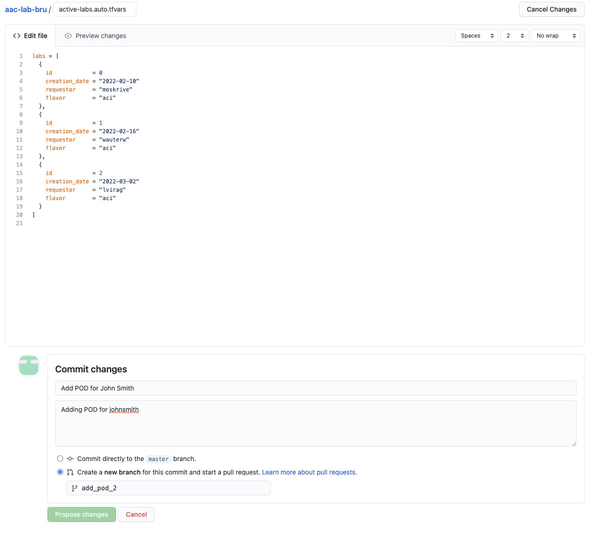

# Quick Start

There are a limited number of virtual lab instances available in the [CX Brussels Lab](http://emear-coe-lab), which can be used for customer demonstrations and/or engineers to familiarize themeselves with the solution. The provisioning and decommissioning of PODs is fully automated and controlled from a single repository as explained below.

## Available flavors

PODs are dynamically created based on a flavor that has to be selected when instantiating the POD. Currently the following flavors are offered:

- `aci`: this will create a Control VM running a GitLab server, and an ACI simulator
- `ndo`: this will create a Control VM running a GitLab server, two ACI simulators and a Nexus Dashboard instance with NDO installed
- `standalone-simulator`: this will create a single ACI simulator
- `standalone-control-vm`: this will create a Control VM running a GitLab server
- `standalone-nd`: this will create a Nexus Dashboard instance with NDO installed

When create a Control VM, Drone and/or Jenkins can be added as well by enabling the respective flags (disabled by default).

## Adding a new POD

In order to create a new POD, edit the [`active-labs.auto.tfvars`](https://wwwin-github.cisco.com/netascode/aac-lab-bru/edit/master/active-labs.auto.tfvars) file directly on GitHub. To add a POD, add an entry as follows below the existing PODs.

An entry will have the following convention:

```
{
  id            = <int>             # select an integer following the highest integer in the file
  creation_date = "<date>"          # <current date in format yyyy-mm-dd>"
  requestor     = "<CEC username>"  # your CEC username
  flavor        = "<aci|ndo|...>"   # flavor you want to create: value can be either 'aci' or 'ndo'
  drone         = true              # Optionally install Drone CI/CD
  jenkins       = true              # Optionally install Jenkins CI/CD
}
```

An example to create a POD consisting of a Control VM and a single ACI simulator would be:

```terraform
{
  id            = 1
  creation_date = "2022-02-16"
  requestor     = "johnsmith"
  flavor        = "aci"
}
```

## Committing the changes

As we directly edited the file, we have to commit the changes. We will use GitHub for this.



Select `Create a new branch for this commit and start a pull request` and press the `Propose changes` button. This will open the pull request which will need to be approved and merged by a lab administrator.

## Accessing the VMs

Once the change has been approved the new POD is being instantiated via a CI/CD pipeline. This can take up to 20-25 minutes as new VMs are being cloned and provisioned in a vSphere enviroment.

After the POD has been instantiated successfully, this [page](./ip_addresses.md) is updated with the IP addresses of the newly provisioned VMs.

These are the default credentials provisioned:

- **ACI simulator**: admin/cisco123
- **Control VM Linux**: lab/cisco123
- **Control VM GitLab**: lab/cisco123
- **Nexus Dashboard**: admin/cisco123

These are the default URLs to access the applications:

- **ACI simulator**: [https://\<SIMULATOR_IP\>]()
- **Control VM GitLab**: [https://\<CONTROL_VM_IP\>]()
- **Control VM Drone**: [http://\<CONTROL_VM_IP\>:30080]()
- **Control VM Jenkins**: [http://\<CONTROL_VM_IP\>:30088]()
- **Nexus Dashboard**: [https://\<NEXUS_DASHBOARD_IP\>]()
