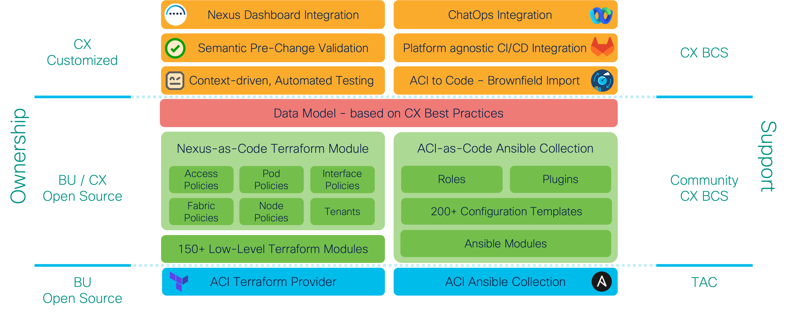

# Overview

The low-level Terraform provider and the ACI modules are open-sourced and freely available from the public Terraform registry. The high-level *ACI as Code* modules and various integrations for automated testing, NAE/NDI, etc. are part of a CX developed solution.

<figure markdown>
  { width="700" }
</figure>

## Structure

One of the key principles of *ACI as Code* is to provide complete separation of data (*variable definition*) from logic (*infrastructure declaration*). This is achieved by separating the *.yaml files which contain the desired ACI state from the Terraform modules which map the definition of the desired to state to Terraform modules and resources. 

```shell
$ tree -L 2
.
├── data
│   ├── apic.yaml
│   ├── access_policies.yaml
│   ├── fabric_policies.yaml
│   ├── node_policies.yaml
│   ├── pod_policies.yaml
│   ├── node_1001.yaml
│   ├── node_101.yaml
│   ├── node_102.yaml
│   └── tenant_PROD.yaml
├── defaults
│   └── defaults.yaml
├── modules
│   ├── access policies
│   ├── fabric_policies
│   ├── interface_policies
│   ├── node_policies
│   ├── pod_policies
│   └── tenant
└── main.tf
```

## ACI Provider

The following Terraform provider is being used together with the *ACI as Code* solution: [link](https://registry.terraform.io/providers/netascode/aci/latest)

The provider includes a single resource and data source which can be used to manage any ACI object. A simple example of how to use the aci_rest resource can be found below:

```Terraform
resource "aci_rest" "fvTenant" {
  dn         = "uni/tn-EXAMPLE_TENANT"
  class_name = "fvTenant"
  content = {
    name  = "EXAMPLE_TENANT"
    descr = "Example description"
  }
}
```

The resource is not only capable of pushing a configuration but also reading its state and reconcile configuration drift.

## ACI Modules

A Terraform module is a container for multiple resources that are used together. Modules can be used to create lightweight abstractions. While a Terraform resource  represents a single API object (single MO in case of ACI), a Terraform Module consists of multiple resources (a branch of MOs in case of ACI).

The modules can be found here: [link](https://registry.terraform.io/search/modules?q=netascode)

A simple example of using one of the modules can be found below:

```Terraform
module "aci_contract" {
  source  = "netascode/contract/aci"
  version = ">= 0.0.1"

  tenant      = "ABC"
  name        = "CONTRACT1"
  subjects = [{
    name          = "SUBJECT1"
    filters = [{
      filter   = "HTTP"
    }]
  }]
}
```

## *ACI as Code* Modules

The *ACI as Code* Terraform modules are responsible for mapping the data to the corresponding ACI modules. The follwing six main modules are being used:

- Access Policies
- Fabric Policies
- Pod Policies
- Node Policies
- Interface Policies
- Tenant

Instead of hardcoding or spreading the definition of default values across different modules, a single file [defaults.yaml](https://wwwin-github.cisco.com/netascode/terraform-aac/blob/master/defaults/defaults.yaml) is used to define all default values in a central location.

This file is typically customized to reflect the specific customer requirements and reduces the overall size of input files as optional parameters with a default value can be ommited. As some customers prefer to append suffixes to object names, such suffixes can be defined once in `defaults.yaml` and then consistently appended to all objects of a specific type including its references.

## CI/CD Integration

A sample [Drone](https://www.drone.io/) pipeline covering all solution components can be found here: [link](https://wwwin-github.cisco.com/netascode/terraform-aac/blob/master/.drone.yml)

## Pre-Change Validation

To perform syntactic and semantic validation [aac-tool](../../cli/overview/) can be used.

## NAE/NDI Integration

Cisco NAE/NDI offers a feature called *Pre-Change Validation* which allows assessing the impact of a planned change before applying it to the infrastructure.

A Python [script](https://wwwin-github.cisco.com/netascode/terraform-aac/blob/master/.ci/nae-pcv.py) pushed the rendered JSON configuration of a planned change to NAE and waits until the Pre-Change Validation has been completed. The JSON configuration is rendered from the *Terraform Plan* output.

```shell
$ export NAE_HOSTNAME_IP="10.1.1.101"
$ export NAE_USERNAME=admin
$ export NAE_PASSWORD=password
$ export NAE_ASSURANCE_GROUP=ACI1
$ terraform plan -out=plan.tfplan
$ terraform show -json plan.tfplan > plan.json
$ python ./.ci/nae-pcv.py "My Terraform PCV" ./plan.json
```

## Automated Testing

To perform automated testing [aac-tool](../../cli/overview/) can be used to dynamically render the [Robot](https://robotframework.org/) test suites and subsequently [Pabot](https://pabot.org/) to execute the tests.

```shell
$ export APIC_TEST_HOSTNAME_IP="10.1.1.100"
$ export APIC_TEST_USERNAME=admin
$ export APIC_TEST_PASSWORD=password
$ mkdir tests
$ aac-tool apic yaml robot --input ./data/ --output ./tests/ --defaults ./defaults/defaults.yaml
$ cd tests/
$ robot -o NONE -l NONE -r NONE apic_login.robot
$ rm apic_login.robot
$ cd ..
$ pabot -d tests/ -V tests/apic_token.py --skiponfailure non-critical tests/
```

## ChatOps

A sample integration with [Webex](https://www.webex.com/) and [Drone](https://www.drone.io/) can be found here: [link](https://wwwin-github.cisco.com/netascode/terraform-aac/blob/master/.drone.yml)

## ACI to Code

[aac-tool](../../cli/overview/) can be used to directly create YAML inventory files from an existing APIC configuration snapshot.
